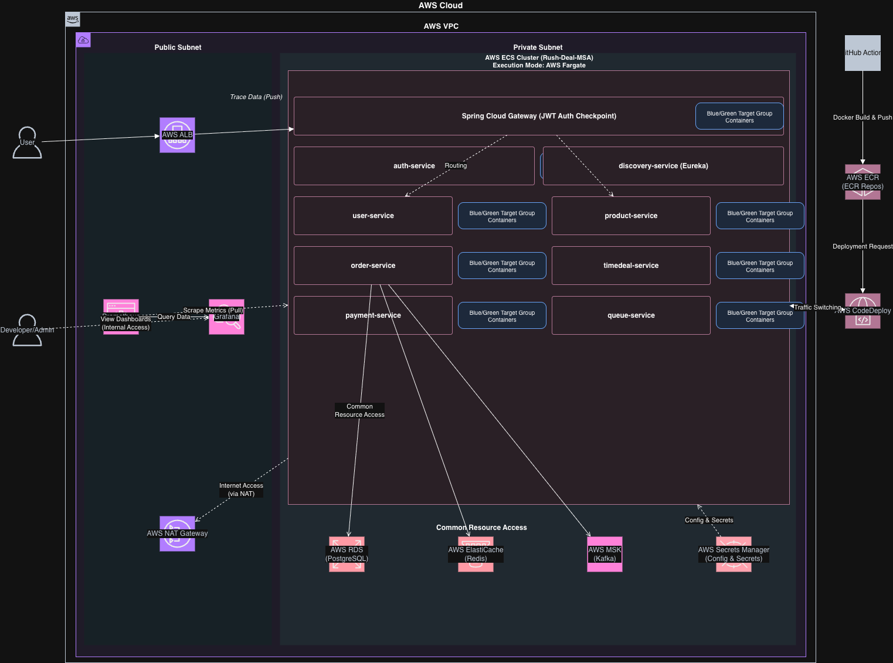
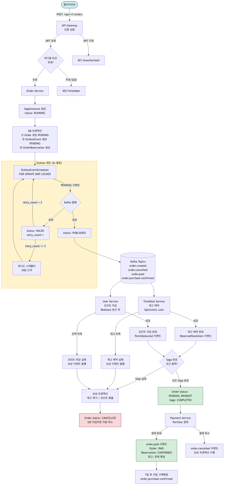
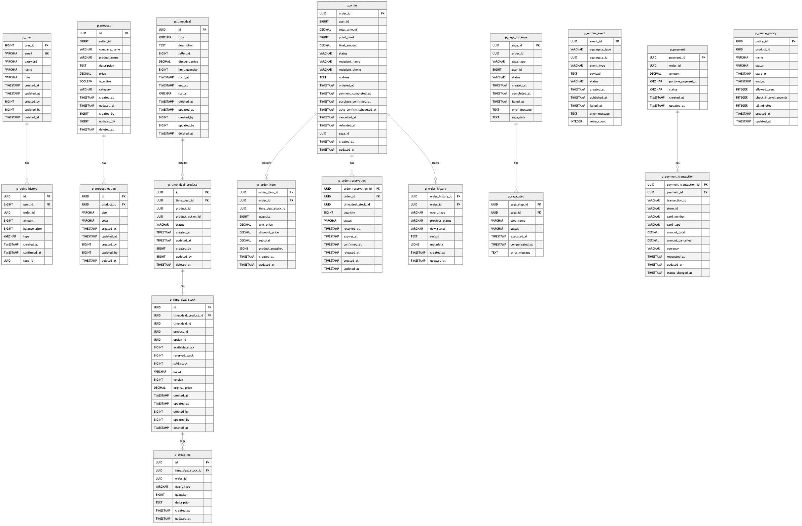

# ⏰ Rush Deal

> 트래픽 집중 상황을 고려한 MSA 기반 타임딜 이커머스 플랫폼


## 목차

- [프로젝트 소개](#-프로젝트-소개)
- [프로젝트 목표](#-프로젝트-목표)
- [로컬 실행 방법](#-로컬-실행-방법)
- [주요 기능](#-주요-기능)
- [팀원 및 역할](#-팀원-및-역할)
- [기술 스택](#-기술-스택)
- [시스템 아키텍처](#-시스템-아키텍처)
- [주문 생성 플로우차트](#-주문-생성-플로우차트)
- [ERD](#-erd)
- [성능 검증](#-성능-검증)
- [프로젝트 구조](#-프로젝트-구조)

---

## 📌 프로젝트 소개

한정된 시간과 수량 안에서 주문이 집중되는 타임딜 커머스 환경의 MSA(Microservices Architecture) 기반 이커머스 플랫폼입니다.

트래픽 집중 상황에서 발생할 수 있는 **동시성·정합성·서비스 병목 문제**를 해결하기 위해 동시성 제어, 비동기 이벤트 기반 서비스 연동, Redis·Kafka·모니터링 도구를 활용한 트래픽 처리 구조를 설계하고 구현했습니다.

---

## 🚩 프로젝트 목표

### 대규모 트래픽 대응
- MSA 기반 서비스 분리로 독립적 확장성 확보
- Redis Sorted Set 대기열과 Kafka 비동기 이벤트로 트래픽 집중 구간 안정화
- 동시성 제어(Optimistic Lock, Redisson 분산 락)로 데이터 정합성 보장

### 배포 및 운영
- Docker 기반 서비스별 실행 환경 통일
- `docker-compose-app.yml` 단일 파일로 전체 인프라·앱·모니터링 일괄 실행
- GitHub Actions + AWS ECS 기반 CI/CD 파이프라인

### 모니터링 시스템 구축
- Prometheus + Grafana를 활용한 메트릭 수집 및 시각화
- Zipkin을 통한 분산 트레이싱 및 병목 지점 분석

---

## ▶️ 로컬 실행 방법

자세한 내용은 [LOCAL_SETUP.md](LOCAL_SETUP.md)를 참고하세요.

**사전 준비:** Docker Desktop, Java 21 (Amazon Corretto 21), `.env` 파일

```bash
./start-local.sh
```

단일 진입점: `http://localhost:8080`

| 기능 | 메서드 | 경로 |
|------|--------|------|
| 회원가입 | POST | `/api/v1/auth/signup` |
| 로그인 | POST | `/api/v1/auth/login` |
| 상품 조회 | GET | `/api/v1/products/**` |
| 타임딜 | GET | `/api/v1/timedeals/**` |
| 주문 | POST | `/api/v1/orders/**` |
| 결제 | POST | `/api/v1/payments/**` |
| 대기열 | GET | `/api/v1/queues/**` |

---

## 🔑 주요 기능

### Saga·Outbox 패턴 기반 고신뢰 주문 시스템
- 주문-재고-포인트 서비스 간 분산 트랜잭션을 **Orchestration Saga**로 관리, 장애 발생 시 자동 보상 트랜잭션 수행
- Outbox 패턴과 `FOR UPDATE SKIP LOCKED`를 결합해 DB 트랜잭션과 Kafka 발행 간 원자성 확보 → **이벤트 발행 성공률 99.9%**
- 멱등성 키 기반 재시도 전략으로 네트워크 장애 상황에서도 **95% 이상 복구율** 구현
- 5분 타임아웃 주문 자동 취소 및 재고·포인트 자동 복구

### Redis Sorted Set 기반 고가용성 대기열
- 대규모 트래픽 DB 병목 해소를 위해 Redis Sorted Set 기반 대기열/활성열 구조 도입
- 전용 Executor(Thread Pool)와 CompletableFuture로 공용 스레드 풀 간섭 제거 및 비동기 처리 최적화
- User Index Key 관리로 **1인 1토큰 원칙** 보장 및 중복 진입 원천 차단

### 낙관적 락 + Redis 선제어 타임딜 재고 관리
- Optimistic Lock으로 재고 수정 시 정합성 유지, Redis 선제어로 불필요한 DB 요청 사전 차단
- Redis Sorted Set 기반 스케줄러 큐로 타임딜 시작/종료 자동화
- 재고 이벤트 로그(`p_stock_log`)로 모든 재고 변동 이력 추적

### CQRS 및 2-Tier 캐싱 조회 성능 최적화
- CQRS 적용 및 2-Tier 캐싱 전략으로 주문 조회 성능 **50배 향상 (500ms → 10ms)**
- Cache Hit Rate 85~90% 유지로 시스템 처리 효율 극대화

### PortOne 연동 결제 서비스
- PortOne 기반 결제 파이프라인 구축으로 결제 준비·완료·취소 구현
- 결제 취소 시 Kafka 이벤트 발행으로 비동기 보상 트랜잭션 수행
- 결제 완료 후 7일 자동 구매확정 스케줄러

### 포인트 시스템
- 포인트 적립·차감·환불을 Kafka 이벤트로 연동해 도메인 간 결합도 최소화
- **Redisson 분산 락**으로 동시 요청에서도 포인트 데이터 무결성 보장
- USE_PENDING → 결제 확정 시 EARN_CONFIRM, 취소 시 USE_CANCEL 상태 전이

---

## 🧑‍🤝‍🧑 팀원 및 역할

| 이름 | 담당 업무 |
|------|-----------|
| [변영재 (팀장)](https://github.com/bbangjae) | 인증 및 인가, 사용자, 포인트 |
| [김민수](https://github.com/Doritosch) | 결제, 모니터링 |
| [민송경](https://github.com/miiiiiin) | 대기열, 배포 |
| [유민아](https://github.com/minahYu) | 상품, 타임딜, 재고 |
| [차초희](https://github.com/chachohee) | 주문 |

---

## 🛠 기술 스택

### Back-End
| 분류 | 기술 |
|------|------|
| Language | Java 21 |
| Framework | Spring Boot 3.5.8, Spring Security |
| Data | Spring Data JPA, Spring Data Redis, PostgreSQL |
| Messaging | Spring Kafka |
| Service Discovery | Spring Cloud Eureka, Spring Cloud Gateway |
| External API | OpenFeign, PortOne |
| Resilience | Resilience4j (Circuit Breaker, Retry, Time Limiter) |

### Infrastructure
| 분류 | 기술 |
|------|------|
| Cloud | AWS ECS (Fargate), RDS (PostgreSQL), ElastiCache (Redis), MSK (Kafka), ECR |
| Container | Docker, Docker Compose |
| CI/CD | GitHub Actions, AWS CodeDeploy |

### Monitoring
| 분류 | 기술 |
|------|------|
| Metrics | Prometheus, Grafana |
| Tracing | Zipkin |
| Kafka UI | Kafka UI (provectuslabs) |

---

## 🏗 시스템 아키텍처



---

## 🔁 주문 생성 플로우차트

Saga·Outbox 패턴 기반의 주문 생성 전체 흐름입니다.



| 단계 | 설명 |
|------|------|
| **대기열 토큰 검증** | API Gateway에서 JWT + 대기열 토큰 동시 검증 |
| **Saga 시작** | SagaInstance 생성(RUNNING), Order 생성(PENDING) |
| **Outbox 발행** | 5s 폴링 + FOR UPDATE SKIP LOCKED로 Kafka 발행, 실패 시 최대 3회 재시도 |
| **재고 예약** | TimeDeal Service - Optimistic Lock 기반 재고 예약 |
| **포인트 차감** | User Service - Redisson 분산 락 기반 포인트 차감 |
| **보상 트랜잭션** | 어느 한 Step 실패 시 완료된 Step 역순 보상 |
| **결제** | Payment Service - PortOne 웹훅으로 결제 완료 처리 |
| **구매확정** | 결제 후 7일 자동 구매확정 스케줄러 |

---

## 🗄 ERD

서비스별 독립 스키마로 분리되어 있으며, 서비스 간 DB 직접 참조는 없습니다.



| 스키마 | 테이블 | 설명 |
|--------|--------|------|
| `user_schema` | p_user, p_point_history | 사용자 정보, 포인트 이력 |
| `product_schema` | p_product, p_product_option | 상품 및 옵션 |
| `time_deal_schema` | p_time_deal, p_time_deal_product, p_time_deal_stock, p_stock_log | 타임딜, 재고, 재고 이력 |
| `order_schema` | p_order, p_order_item, p_order_reservation, p_order_history, p_saga_instance, p_saga_step, p_outbox_event | 주문, Saga, Outbox |
| `payment_schema` | p_payment, p_payment_transaction | 결제, 결제 트랜잭션 |
| `queue_schema` | p_queue_policy | 대기열 정책 (토큰은 Redis 전용) |
| `auth` | — | JWT 토큰은 Redis 전용 (DB 없음) |

---

## 📊 성능 검증

### 동시 주문 부하 테스트

| 테스트 규모 | 성공률 | P95 응답시간 | 처리량 | 데이터 정합성 |
|------------|--------|------------|--------|--------------|
| **100명** | 73% | 2.51초 | 38.9 RPS | 100% ✅ |
| **1,000명** | 75.30% | 6.01초 | 154.19 RPS | 100% ✅ |

### 핵심 검증 결과

- ✅ **1,000명 동시 주문**: 753건 성공 (75.30%), 재고·포인트 정합성 100% 보장
- ✅ **큐 시스템**: 1,000명 토큰 발급 100% 성공 (P95 1.38초)
- ✅ **스케일업**: 100명(38.9 RPS) → 1,000명(154.19 RPS), 처리량 4배 향상
- ✅ **자동 취소**: PENDING 주문 5분 타임아웃 자동 취소 및 보상 트랜잭션 100% 성공

### 시연 영상

- [100명 동시 주문 테스트](https://youtu.be/zYQMJPPH7uQ)
- [1,000명 동시 주문 테스트](https://youtu.be/54cJzqk-PPM)

---

## 📂 프로젝트 구조

```
rush-deal/
├── api-gateway/          # 요청 라우팅, JWT 인증, 대기열 토큰 검증
├── discovery-service/    # 서비스 디스커버리 (Eureka)
├── auth-service/         # 인증, JWT 발급·갱신·블랙리스트
├── user-service/         # 사용자 관리, 포인트 적립·차감
├── product-service/      # 상품 및 옵션 관리
├── timedeal-service/     # 타임딜 생성·관리, 재고 제어
├── order-service/        # 주문 처리, Saga 오케스트레이션, Outbox
├── payment-service/      # 결제 (PortOne 연동)
├── queue-service/        # Redis 대기열 토큰 발급·관리
├── monitoring/           # Prometheus, Grafana 설정
├── docs/                 # 아키텍처, ERD, 플로우차트 이미지
├── scripts/              # DB 초기화 SQL
├── docker-compose-app.yml   # 로컬 전체 실행 (인프라 + 앱 + 모니터링)
├── docker-compose.yml       # 인프라 전용 (IDE 개발용)
├── Dockerfile.local         # 로컬 빌드용 (JAR 복사)
├── Dockerfile.template      # CI/CD용 (Docker 내부 빌드)
├── start-local.sh           # 로컬 전체 실행 스크립트
├── stop-local.sh            # 로컬 전체 종료 스크립트
└── LOCAL_SETUP.md           # 로컬 실행 가이드
```
