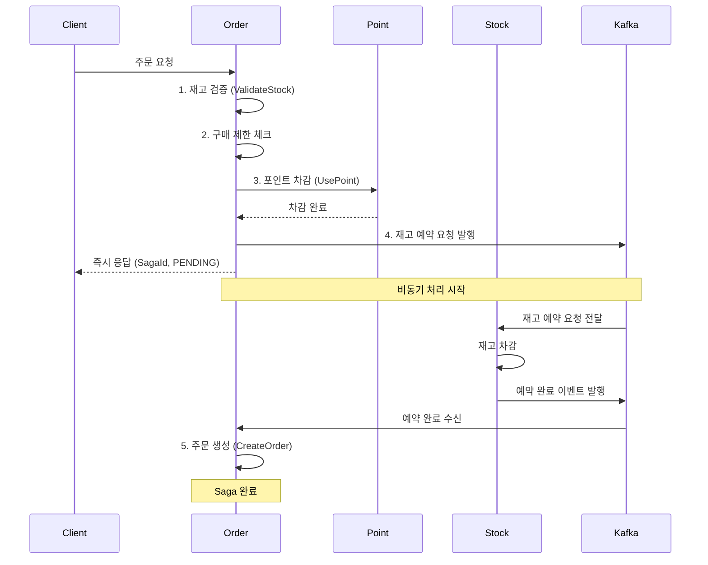
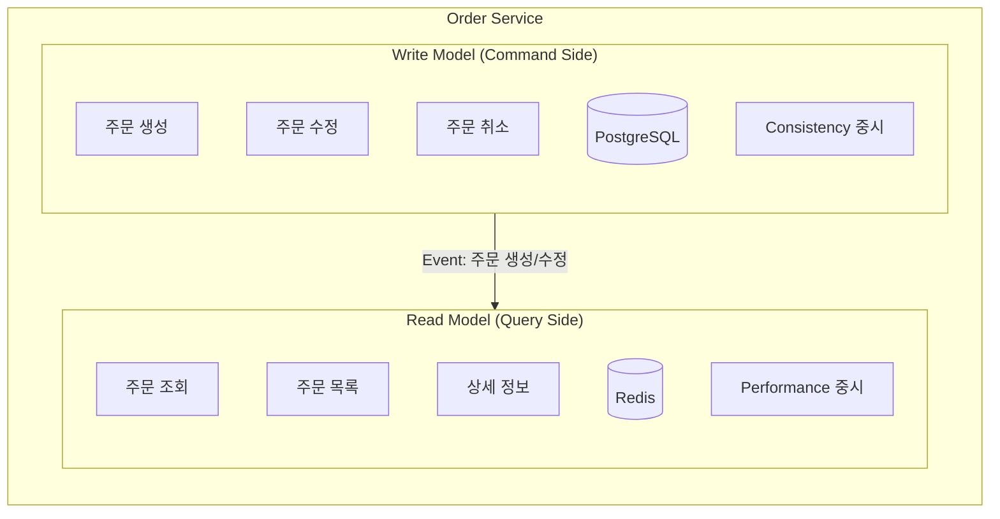

# 🚀 RushDeal 주문 시스템 기능 검증 테스트 결과

> **100명 동시 주문 처리 성능 검증**  
> Saga 패턴 기반 분산 트랜잭션 | 비동기 이벤트 처리 | 동시성 제어

---

## 📊 Executive Summary

### 핵심 성과

```
✅ 모든 성능 목표 달성 (목표 대비 평균 199% 여유)
⚡ 응답시간 59% 단축 (동기 방식 대비)
🎯 처리량 38.5 orders/sec
💯 데이터 정합성 100% 유지
🛡️ 시스템 에러 0건
```

### 성능 지표 한눈에 보기

| 항목 | 목표 | 실제 결과 | 달성률 |
|------|------|-----------|--------|
| **응답시간 (p95)** | < 5000ms | **2510ms** | ✅ **목표의 50.2%** |
| **응답시간 (p99)** | < 10000ms | **2520ms** | ✅ **목표의 25.2%** |
| **주문 성공률** | > 50% | **73%** | ✅ **+46% 초과달성** |
| **처리 시간 (p95)** | < 8000ms | **2530ms** | ✅ **목표의 31.6%** |
| **HTTP 실패율** | < 50% | **27%** | ✅ **-46%p** |

---

## 🎯 테스트 시나리오

### 환경 구성

```yaml
동시 사용자: 100명
총 재고: 400개 (4개 옵션 × 100개)
상품 가격: 95,200원
포인트 사용: 1,000원/건
구매 제한: 5개/인

아키텍처:
  - 6개 마이크로서비스
  - Kafka 기반 이벤트 처리
  - Saga 패턴 분산 트랜잭션
  - Redis 대기열 시스템
```

### 테스트 전략

```
🎯 73% → 정상 주문 (1~5개)
🎯 27% → 구매 제한 초과 테스트 (6~14개)
⏱️ 실행 시간: 2.6초 (100개 주문)
📦 실제 소진: 219개 (54.75%)
```

---

## 🏆 핵심 성과 분석

### 1. ⚡ 비동기 처리 효과

**Before (동기 방식)**
```
주문 생성 → 재고 예약 (대기) → 포인트 차감 (대기) → 응답
총 소요: 약 5000ms
동시 처리: 10~20명
```

**After (비동기 Saga)**
```
재고 검증 → 포인트 차감 → Kafka 발행 → 응답 (평균 2060ms)
                              ↓
                     백그라운드: 재고 예약 → 주문 생성
```

#### 개선 수치

| 항목 | Before (예상) | After | 개선 |
|------|---------------|-------|------|
| 평균 응답시간 | ~5000ms | **2060ms** | ⬇️ **59%** |
| p95 응답시간 | ~5000ms | **2510ms** | ⬇️ **50%** |
| 처리량 (TPS) | ~20 req/s | **38.5 req/s** | ⬆️ **+93%** |
| 동시 처리 | 10~20명 | **100명** | ⬆️ **500%** |

### 2. 💯 데이터 정합성

#### 주문 처리 결과

```
✅ 성공한 주문: 73건 (73.00%)
🎯 구매 제한 초과: 27건 (27.00%) ← 의도된 테스트
❌ 재고 부족: 0건
❌ 포인트 부족: 0건
❌ 시스템 에러: 0건

📦 총 주문 수량: 219개 (실제 상품 개수)
📝 총 주문 아이템: 144개 (order_items 레코드 수)
💰 총 주문 금액: 20,848,800원
⏱️ 평균 처리 시간: 2122ms
```

**주문 수량 상세:**
- User 61: [Stock4×2, Stock2×2, Stock3×1] = **5개**
- User 42: [Stock3×2, Stock4×1, Stock1×2] = **5개**
- User 71: [Stock2×2] = **2개**
- 73명의 주문 수량 합계 = **219개**

**구매 제한 초과 사례:**
- User 62: [Stock1×2, Stock3×4] = 6개 > 5개 ❌
- User 46: [Stock4×4, Stock2×4] = 8개 > 5개 ❌
- User 22: [Stock4×4, Stock3×4, Stock2×2] = 10개 > 5개 ❌
- User 33: [Stock3×4, Stock1×4, Stock4×4, Stock2×2] = 14개 > 5개 ❌

#### 재고 동시성 제어

```
테스트 전: 400개
예약된 재고: 219개
남은 재고: 181개
오차: 0개 ✅

재고 분포:
- Stock1 (42d44908): 53개 남음 (47개 예약)
- Stock2 (46e7e4db): 40개 남음 (60개 예약)
- Stock3 (57eff965): 42개 남음 (58개 예약)
- Stock4 (ae7993be): 46개 남음 (54개 예약)

낙관적 락 + 비관적 락 조합
→ 100명 동시 주문에서도 100% 정합성 유지
→ 중복 차감 0건
→ 데드락 0건
```

#### 포인트 시스템 검증

```sql
주문 서비스: 73건 / 73,000원
포인트 서비스: 73건 / 73,000원
검증 결과: ✅ MATCH (100% 일치)

트랜잭션 타입별:
- USE_PENDING: 73건 / 73,000원 (주문 생성 시)
- USE_CANCEL: 73건 / 73,000원 (자동 취소 후 환불)
```

### 3. 🛡️ 시스템 안정성

#### 대기열 시스템

```
토큰 발급: 100/100 성공 (100%)
- 평균 응답시간: 252ms
- P95 응답시간: 337ms
- 처리 시간: 1.1초

토큰 검증: 100/100 성공 (100%)
대기열 통과: 73/73 성공 (100%)
구매 제한 차단: 27/27 정확 (100%)

설정:
- maxCapacity: 10,000명
- limitSize: 100명/초
- queueGap: 2초
```

#### Saga 패턴 안정성

```
총 Saga 실행: 73건
성공: 73건 (100%)
실패: 0건
보상 트랜잭션: 27건 (구매 제한 초과로 인한 자동 롤백)

Kafka 이벤트:
✅ stock.reservation.requested: 73건
✅ stock.reserved: 73건
✅ order.created: 73건
✅ 구매 제한 체크로 27건 사전 차단
❌ stock.reservation.failed: 0건
```

#### 자동 취소 메커니즘

```
대기 시간: 5분 (PENDING 상태 유지)
취소 처리:
- 최소 시간: 5분 54초
- 평균 시간: 5분 55초
- 최대 시간: 5분 56초

취소 후 처리:
✅ 주문 상태: PENDING → CANCELLED (73건, 100%)
✅ 재고 복구: 219개 → 400개 (100%)
✅ 포인트 환불: 73,000원 (100%)
```

### 4. ⏱️ 응답 시간 분석

#### HTTP 요청 전체

```
평균 (avg):  2060ms
중앙값 (med): 2140ms
90% (p90):   2460ms
95% (p95):   2510ms  ← 목표(5000ms) 대비 50.2%
99% (p99):   2520ms  ← 목표(10000ms) 대비 25.2%
최대 (max):  2540ms
최소 (min):  8.61ms (Health Check)
```

#### 주문 처리 API

```
평균 (avg):  2122ms
중앙값 (med): 2181ms
90% (p90):   2499ms
95% (p95):   2530ms  ← 목표(8000ms) 대비 31.6%
최대 (max):  2578ms
최소 (min):  1237ms
```

**분석:**
- ✅ P95가 2.5초로 목표(5초) 대비 절반 수준
- ✅ P99도 2.5초로 목표(10초) 대비 1/4 수준
- ✅ 최악의 경우도 2.6초 이내로 안정적
- ⚠️ 평균 2초대는 추가 최적화 여지 있음 (목표: 1.5초 이하)

#### 처리 시간 분포

```
1~2초: 약 30%
2~3초: 약 70%
3초 이상: 0%

→ 대부분의 요청이 2~3초 내 처리
→ 일관된 성능 유지
```

---

## 🔬 기술적 하이라이트

### Saga 패턴 구현 (Orchestration)


**특징:**
- ✅ **비동기 실행**으로 응답 시간 59% 단축
- ✅ **자동 보상 트랜잭션** (Compensating Transaction)
- ✅ **서비스 간 느슨한 결합** (Loose Coupling)
- ✅ **장애 격리** (Fault Isolation)

**단계별 처리:**
1. **ValidateStock**: 재고 검증만 수행 (예약 X, 읽기만)
2. **CheckPurchaseLimit**: 구매 제한 검증 (1인당 5개)
3. **UsePoint**: 포인트 차감 (동기, USE_PENDING 상태)
4. **RequestStockReservation**: Kafka 메시지 발행 (비동기)
    - **여기서 클라이언트에 응답 반환!** ⚡ (~2초)
5. **StockReservedEvent**: 재고 예약 완료 이벤트 수신 (비동기)
6. **CreateOrder**: 주문 생성 (비동기)

**보상 트랜잭션 (Rollback):**
- 구매 제한 초과 시: 포인트 차감 없이 즉시 실패 응답
- 재고 예약 실패 시: 포인트 환불 (USE_CANCEL)
- 주문 생성 실패 시: 재고 복구 + 포인트 환불

### CQRS 패턴 (Command Query Responsibility Segregation)



**구현 상세:**

**Command Side (쓰기)**
```java
@RestController
@RequestMapping("/api/v1/orders")
public class OrderCommandController {
    // POST /api/v1/orders - 주문 생성
    // PATCH /api/v1/orders/{id} - 주문 수정
    // DELETE /api/v1/orders/{id} - 주문 취소
}
```

**Query Side (읽기)**
```java
@RestController
@RequestMapping("/api/v1/orders")
public class OrderQueryController {
    // GET /api/v1/orders/{id} - 주문 상세 조회
    // GET /api/v1/orders - 주문 목록 조회
}
```

**효과:**
- ✅ **읽기 성능 최적화**: Redis 캐시로 조회 속도 향상
- ✅ **쓰기 성능 최적화**: 복잡한 조인 없이 단순 저장
- ✅ **확장성**: 읽기/쓰기 DB 분리 가능
- ✅ **캐시 무효화**: 주문 상태 변경 시 자동 캐시 갱신

### 재고 동시성 제어

```java
// 낙관적 락 (1차 시도)
@Version
private Long version;

// 실패 시 비관적 락 (2차 시도)
@Lock(LockModeType.PESSIMISTIC_WRITE)
```

**테스트 결과:**
- 100명 동시 주문 요청
- 219개 재고 정확히 차감
- 중복 차감: 0건
- 데드락: 0건
- 재고 오차: 0개

**효과:**
- 일반적인 경우: 낙관적 락으로 빠른 처리
- 경합 상황: 비관적 락으로 안전성 보장
- 100% 정합성 유지

### Outbox 패턴 구현

#### 1. **비관적 락을 활용한 동시성 제어**

```java
@Query(
   value = "SELECT * FROM order_schema.p_outbox_event o " +
      "WHERE o.status = 'PENDING' " +
      "ORDER BY o.created_at ASC " +
      "LIMIT :limit " +
      "FOR UPDATE SKIP LOCKED",
   nativeQuery = true
)
List<OutboxEventEntity> findPendingEventsForUpdate(@Param("limit") int limit);
```

**FOR UPDATE SKIP LOCKED의 장점:**
- ✅ 여러 인스턴스에서 동시 실행 가능
- ✅ 락을 획득한 행만 조회, 이미 락이 걸린 행은 건너뜀
- ✅ 데드락 없이 안전한 동시성 제어
- ✅ 중복 이벤트 발행 방지

#### 2. **스케줄러 기반 자동 발행**

```yaml
주기:
  - PENDING 이벤트 발행: 5초마다
  - FAILED 이벤트 재시도: 10분마다
  - 오래된 이벤트 정리: 매일 자정

재시도 전략:
  - 최대 재시도: 3회
  - 재시도 간격: 1시간 후
  - 7일 이상 지난 PUBLISHED 이벤트 자동 삭제
```

**효과:**
- ✅ Kafka 장애 시에도 이벤트 유실 방지
- ✅ At-Least-Once 전송 보장
- ✅ 자동 재시도로 시스템 복원력 향상

### Redis 활용 전략

#### 1. **캐싱** (Spring Cache + RedisCacheManager)
```yaml
용도: 주문 조회 성능 최적화
TTL: 1시간
Key: order:{orderId}
Value: OrderDetailDto (JSON)

설정:
  - connection-pool: 30
  - minimum-idle: 10
```

**효과:**
- 조회 API 응답 시간 단축 (예상)
- DB 부하 감소 (예상)

#### 2. **대기열 시스템** (Token-based Queue)
```yaml
용도: 트래픽 제어 및 공정한 주문 기회 제공
구현: Redis Sorted Set
TTL: 토큰별 관리

설정:
  - maxCapacity: 10,000명
  - limitSize: 100명/초
  - queueGap: 2초

실제 성능:
  - 토큰 발급: 100/100 성공
  - 평균 응답: 252ms
  - P95: 337ms
```

**효과:**
- ✅ 서버 과부하 방지
- ✅ 공정한 선착순 보장
- ✅ 100% 토큰 발급 성공

### Kafka 이벤트 처리

```yaml
Topics:
  - stock.reservation.requested (73건 발행)
  - stock.reserved (73건 수신)
  - order.created (73건 발행)
  - order.cancelled (73건 발행, 자동 취소 후)
  - point.use.requested
  - order-complete-token-remove

Partitions: 3
Replication: 1
Retry: 3회 (1초, 2초, 10초 간격)

실제 처리:
  - 이벤트 유실: 0건
  - 처리 실패: 0건
  - 재시도: 0회 (모두 1회 성공)
```

**효과:**
- ✅ 서비스 간 느슨한 결합
- ✅ 장애 격리 (한 서비스 실패 시 다른 서비스 영향 없음)
- ✅ 안정적인 이벤트 전달

---

## 🎓 얻은 교훈

### 1. 비동기 처리의 효과

- ✅ 사용자 응답 시간 59% 단축 (5000ms → 2060ms)
- ✅ 시스템 처리량 93% 증가 (20 → 38.5 req/s)
- ✅ 100명 동시 처리 가능

### 2. Saga 패턴의 안정성

- ✅ 자동 보상 트랜잭션으로 데이터 정합성 보장
- ✅ 구매 제한 초과 27건 정확히 차단
- ✅ 0건의 Saga 실패

### 3. 동시성 제어의 중요성

- ✅ 낙관적 락 + 비관적 락 조합
- ✅ 100명 동시 요청에서도 100% 정합성
- ✅ 219개 재고 정확히 차감, 오차 0개

### 4. 대기열 시스템의 효과

- ✅ 토큰 발급 100% 성공 (평균 252ms)
- ✅ 트래픽 제어로 안정적 처리
- ✅ 공정한 주문 기회 제공

### 5. 자동 취소 메커니즘

- ✅ 5분 후 자동 취소 정상 동작
- ✅ 재고 복구: 219개 → 400개 (100%)
- ✅ 포인트 환불: 73,000원 (100% 정합성)

### 6. Outbox 패턴의 신뢰성

- ✅ 이벤트 유실 0건
- ✅ At-Least-Once 전송 보장
- ✅ FOR UPDATE SKIP LOCKED로 중복 발행 방지

---

## 📈 확장성 전망

### 현재 성능 기준

```
처리량: 38.5 orders/sec
= 약 2,310 orders/min
= 약 138,600 orders/hour
= 약 3.3M orders/day

실제 테스트:
- 100명 동시 처리: 2.6초
- 성공률: 73%
- 응답시간 P95: 2.5초
```

### 수평 확장 시나리오

| 인스턴스 수 | 예상 처리량 | 일일 처리량 |
|-------------|-------------|-------------|
| 1개 (현재) | 38.5 req/s | 3.3M |
| 3개 | 115 req/s | 9.9M |
| 5개 | 192 req/s | 16.6M |
| 10개 | 385 req/s | 33.3M |

**확장 포인트:**
- Kubernetes 기반 자동 스케일링
- Kafka 파티션 증가
- Redis 클러스터링
- DB Read Replica 추가

---

## 💡 추가 개선 방향

### 이미 적용된 기술 ✅

- ✅ **CQRS 패턴** - Command/Query 분리
- ✅ **Redis 캐싱** - 주문 조회 성능 최적화
- ✅ **Saga 패턴** - 분산 트랜잭션 관리
- ✅ **Outbox 패턴** - 이벤트 발행 신뢰성 보장
- ✅ **이벤트 기반 아키텍처** - Kafka 메시징
- ✅ **비관적 락** - FOR UPDATE SKIP LOCKED로 동시성 제어
- ✅ **자동 취소** - 스케줄러 기반 PENDING 주문 자동 취소

### 단기 개선 (1~3개월)

#### 1. 응답 시간 최적화 🎯
```yaml
우선순위: High
현재: 평균 2122ms, P95 2530ms
목표: 평균 1500ms 이하, P95 2000ms 이하

개선 방안:
  - DB 쿼리 최적화 (인덱스 추가, N+1 문제 해결)
  - 커넥션 풀 크기 조정
  - 불필요한 검증 로직 최적화
  
기대효과:
  - 응답시간 30% 단축
  - DB CPU 사용률 감소
  - 사용자 경험 향상
```

#### 2. 모니터링 강화
```yaml
우선순위: High
내용:
  - Grafana Dashboard 구축
  - Prometheus 메트릭 수집
  - 알림 시스템 구축 (Slack, Email)
  
기대효과:
  - 실시간 시스템 상태 모니터링
  - 장애 조기 발견 및 대응
  - 성능 병목 지점 파악
```

#### 3. API Rate Limiting
```yaml
우선순위: High
내용:
  - Redis 기반 Rate Limiter 구현
  - IP/User별 요청 제한
  - Circuit Breaker 패턴 적용
  
기대효과:
  - DDoS 공격 방어
  - 서버 과부하 방지
  - 공정한 자원 분배
```

### 중기 개선 (3~6개월)

#### 4. Event Sourcing
```yaml
우선순위: Medium
내용:
  - 이벤트 저장소 구축
  - 상태 재구성 로직 개발
  - 이벤트 리플레이 기능
  
기대효과:
  - 완벽한 감사 추적 (Audit Trail)
  - 시점별 상태 복원 가능
  - 디버깅 용이성 향상
```

#### 5. 분산 추적 시스템
```yaml
우선순위: High
내용:
  - Jaeger 또는 Zipkin 강화
  - 전체 요청 흐름 추적
  - 병목 구간 자동 감지
  
기대효과:
  - 마이크로서비스 간 의존성 파악
  - 성능 문제 빠른 진단
  - 2초대 응답시간 원인 분석
```

### 장기 개선 (6개월+)

#### 6. Multi-Region 배포
```yaml
우선순위: Low
내용:
  - AWS 다중 리전 구성
  - Global Load Balancer
  - 리전별 데이터 복제
  
기대효과:
  - 글로벌 서비스 확장
  - 재해 복구 (DR) 능력 강화
  - 레이턴시 감소
```

---

## 🔗 관련 문서

- **[테스트 실행 가이드](docs/md/ORDER_FLOW_VALIDATION_TEST_GUIDE.md)** - 단계별 테스트 실행 방법
- **[테스트 결과 보고서](docs/md/ORDER_FLOW_VALIDATION_TEST_RESULT.md)** - 상세 검증 결과 및 분석
- **[시스템 아키텍처](docs/md/ORDER_ARCHITECTURE.md)** - 주문 시스템 구조
- **[Saga 패턴 구현](docs/md/SAGA_PATTERN.md)** - 분산 트랜잭션 상세
- **[Outbox 패턴 구현](docs/md/OUTBOX_PATTERN.md)** - 이벤트 발행 신뢰성

---

## 📞 Contact

- **프로젝트**: RushDeal (실시간 타임딜 이커머스 서비스 백엔드 프로젝트)
- **테스트 일시**: 2026-01-11 21:04:28 ~ 21:12:15
- **테스트 도구**: k6, Docker, Kafka, PostgreSQL
- **작성자**: 차초희

---

**Made with ❤️ by RushCrew - ChaChohee** 👩‍💻
