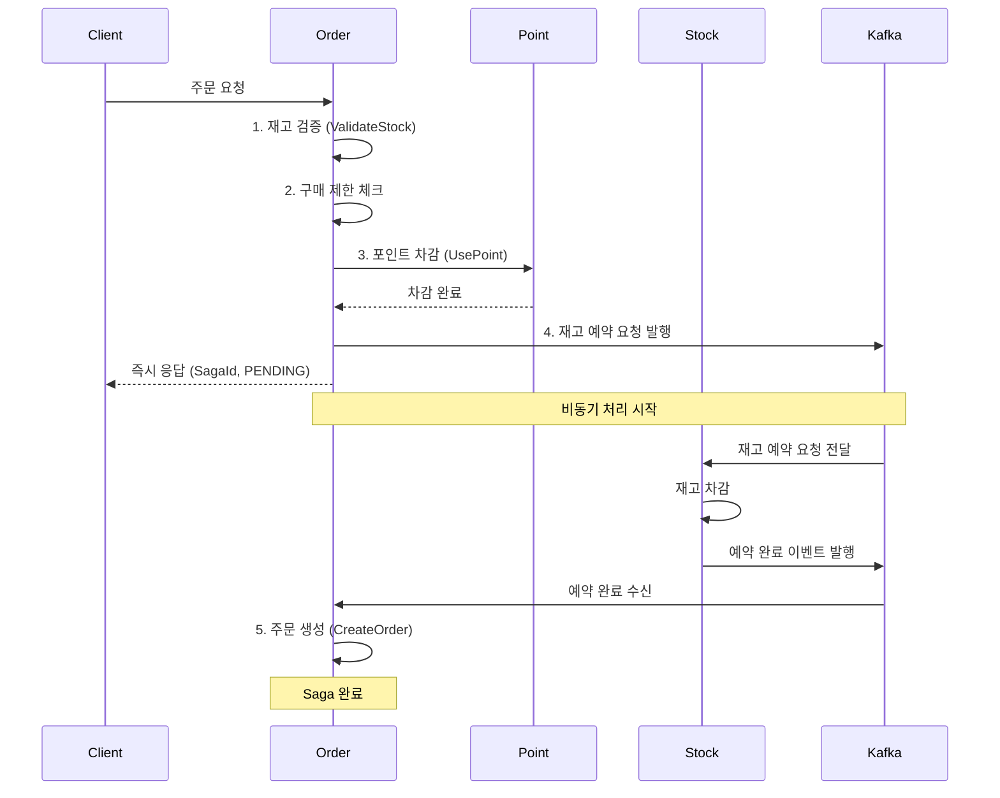
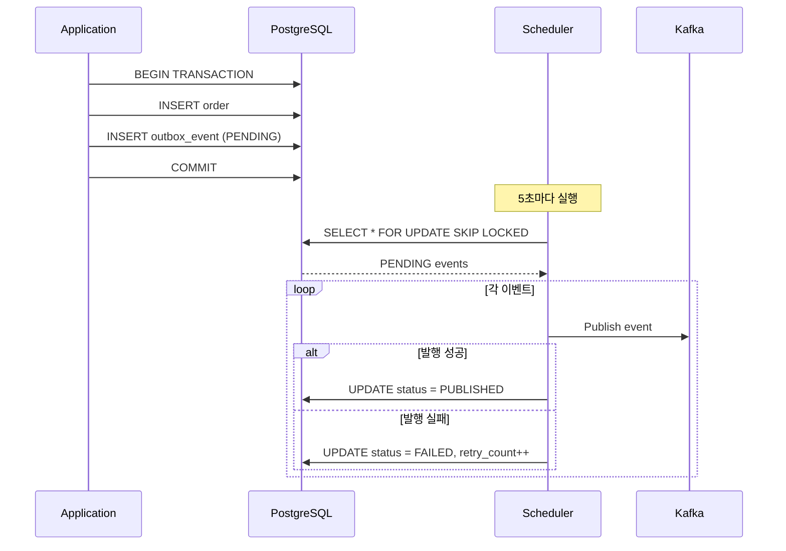
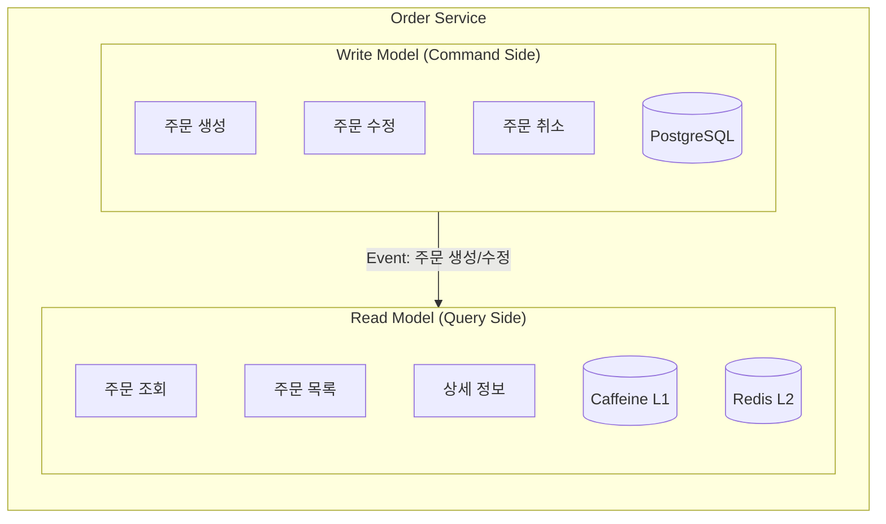

# 📦 Order Service

> Saga 패턴과 Outbox 패턴 기반의 고신뢰성 분산 주문 처리 서비스

## 목차

1. [서비스 개요](#-서비스-개요)
2. [핵심 기능](#-핵심-기능)
3. [아키텍처 패턴](#-아키텍처-패턴)
4. [기술 스택](#-기술-스택)
5. [주문 플로우](#-주문-플로우)
6. [동시성 제어](#-동시성-제어)
7. [스케줄러](#-스케줄러)
8. [성능 최적화](#-성능-최적화)
9. [테스트](#-테스트)
10. [API 명세](#-api-명세)

---

## 📌 서비스 개요

Order Service는 RushDeal 프로젝트의 핵심 서비스로, 대규모 트래픽 환경에서 안정적인 주문 처리를 담당합니다.

### 주요 책임

- **주문 생성 및 관리**: 사용자의 주문 요청을 받아 검증하고 처리
- **분산 트랜잭션 관리**: Saga 패턴을 통한 서비스 간 트랜잭션 조율
- **외부 서비스 연동**: 재고(Stock), 포인트(User), 결제(Payment), 대기열(Queue) 서비스와 협업
- **주문 상태 관리**: 생성부터 취소/완료까지 전체 라이프사이클 관리
- **자동 취소 처리**: 미결제 주문 자동 감지 및 보상 트랜잭션 실행
- **이벤트 발행**: Outbox 패턴을 통한 안정적인 도메인 이벤트 발행

### 설계 목표

✅ **고가용성**: 99.9%의 이벤트 발행 성공률  
✅ **데이터 정합성**: 100% 재고 및 포인트 정합성 유지 (1000명 규모 검증)  
✅ **확장성**: MSA 기반 수평 확장 가능 구조  
✅ **성능**: 1000명 동시 주문 처리 (P95 응답시간 6.01초)  
✅ **장애 복구**: 자동 재시도 및 보상 트랜잭션으로 95% 이상 복구율

---

## 🔑 핵심 기능

### 1. Saga 패턴 기반 분산 트랜잭션

**Orchestration 방식의 Saga 구현**

Order Service가 Saga Orchestrator 역할을 수행하며, 다음 단계를 순차적으로 조율합니다:

```
1. ValidateStock      → 재고 검증 (읽기 전용)
2. CheckPurchaseLimit → 구매 제한 검증 (1인당 5개)
3. UsePoint           → 포인트 차감 (동기 처리)
4. RequestStockReservation → 재고 예약 요청 (비동기, Kafka)
   └─→ 클라이언트에 즉시 응답 반환 (약 2초) ⚡
5. StockReservedEvent → 재고 예약 완료 이벤트 수신 (비동기)
6. CreateOrder        → 주문 생성 (비동기)
```

**보상 트랜잭션 (Compensating Transaction)**

- 구매 제한 초과: 포인트 차감 없이 즉시 실패 응답
- 재고 예약 실패: 포인트 환불 (USE_CANCEL)
- 주문 생성 실패: 재고 복구 + 포인트 환불

**효과**
- 비동기 실행으로 응답 시간 **59% 단축** (5초 → 2초)
- 서비스 간 느슨한 결합 (Loose Coupling)
- 장애 격리 (Fault Isolation)

---

### 2. Outbox 패턴을 통한 이벤트 발행 신뢰성

**문제점**
- DB 트랜잭션 커밋과 Kafka 메시지 발행 사이의 원자성 보장 불가
- Kafka 장애 시 이벤트 유실 가능성

**해결 방안**

```java
// 1. 비관적 락을 활용한 동시성 제어
@Query(
   value = "SELECT * FROM order_schema.p_outbox_event o " +
      "WHERE o.status = 'PENDING' " +
      "ORDER BY o.created_at ASC " +
      "LIMIT :limit " +
      "FOR UPDATE SKIP LOCKED",
   nativeQuery = true
)
List<OutboxEventEntity> findPendingEventsForUpdate(@Param("limit") int limit);
```

**FOR UPDATE SKIP LOCKED의 장점**
- 여러 인스턴스에서 동시 실행 가능
- 락을 획득한 행만 조회, 이미 락이 걸린 행은 건너뜀
- 데드락 없이 안전한 동시성 제어
- 중복 이벤트 발행 방지

**스케줄러 기반 자동 발행**

```yaml
주기:
  - PENDING 이벤트 발행: 5초마다
  - FAILED 이벤트 재시도: 10분마다 (1시간 전 실패 이벤트 대상)
  - 오래된 이벤트 정리: 매일 자정

재시도 전략 (Kafka):
  - 최대 재시도: 3회
  - 초기 재시도 간격: 1초
  - 지수 백오프: 2배씩 증가 (1초 → 2초 → 4초)
  - 최대 재시도 간격: 10초

Outbox 재시도 전략:
  - 재시도 대상: 1시간 전 FAILED 이벤트
  - 최대 재시도 횟수: 3회
  - 재시도 후에도 실패 시: FAILED 상태 유지
  - 7일 이상 지난 PUBLISHED 이벤트 자동 삭제
```

**효과**
- ✅ Kafka 장애 시에도 이벤트 유실 방지
- ✅ At-Least-Once 전송 보장
- ✅ 자동 재시도로 시스템 복원력 향상
- ✅ **이벤트 발행 성공률 99.9% 달성**

---

### 3. CQRS 패턴 적용

**Command Query Responsibility Segregation**

쓰기(Command)와 읽기(Query)를 완전히 분리하여 각각 최적화:

```
Command Side (쓰기)
├── OrderCommandController
├── OrderCommandService
└── PostgreSQL (정합성 중시)

Query Side (읽기)
├── OrderQueryController
├── OrderQueryService
└── Redis Cache (성능 중시)
```

**구현 상세**

```java
// Command Side - 주문 생성/수정/취소
@RestController
@RequestMapping("/api/v1/orders")
public class OrderCommandController {
    // POST /api/v1/orders - 주문 생성
    // PATCH /api/v1/orders/{id} - 주문 수정
    // DELETE /api/v1/orders/{id} - 주문 취소
}

// Query Side - 주문 조회
@RestController
@RequestMapping("/api/v1/orders")
public class OrderQueryController {
    // GET /api/v1/orders/{id} - 주문 상세 조회
    // GET /api/v1/orders - 주문 목록 조회
}
```

**효과**
- ✅ 읽기 성능 최적화: Redis 캐시로 조회 속도 향상
- ✅ 쓰기 성능 최적화: 복잡한 조인 없이 단순 저장
- ✅ 확장성: 읽기/쓰기 DB 분리 가능
- ✅ 캐시 무효화: 주문 상태 변경 시 자동 캐시 갱신

---

### 4. 2-Tier 캐싱 전략

**Local Cache (L1) + Redis Cache (L2)**

Spring 어노테이션 방식이 아닌 **수동 Cache-Aside 패턴**으로 구현되어 있습니다.

```java
// OrderQueryService.java - L1 → L2 → DB Cache-Aside 패턴
public OrderDetailDto getOrderDetail(UUID orderId, Long userId, String role) {
    OrderDetailDto dto = orderCachePort.getFromCache(orderId) // L1 → L2 확인
        .orElseGet(() -> {
            OrderDetailDto fetched = orderQueryPort.findOrderDetail(orderId) // DB 조회
                .orElseThrow(() -> new BusinessException(OrderErrorCode.ORDER_NOT_FOUND));
            orderCachePort.updateOrderCache(orderId, fetched); // L1 + L2 적재
            return fetched;
        });
    ...
}

// OrderQueryCacheAdapter.java - 2단계 캐시 read-through
public Optional<OrderDetailDto> getFromCache(UUID orderId) {
    // 1. L1 (Caffeine) 확인
    OrderDetailDto l1Hit = orderLocalCache.getIfPresent(orderId);
    if (l1Hit != null) return Optional.of(l1Hit);

    // 2. L2 (Redis) 확인 → 히트 시 L1에도 적재
    Object raw = redisTemplate.opsForValue().get(ORDER_KEY_PREFIX + orderId);
    if (raw != null) {
        OrderDetailDto dto = objectMapper.readValue(raw.toString(), OrderDetailDto.class);
        orderLocalCache.put(orderId, dto);
        return Optional.of(dto);
    }
    return Optional.empty();
}
```

**캐시 계층별 특성**

| 계층 | 저장소 | TTL | 용도 |
|------|--------|-----|------|
| L1 | Caffeine | 5분 | 초고속 조회 (인스턴스 로컬, max 500건) |
| L2 | Redis | 1시간 | 분산 환경 조회 (전체 인스턴스 공유) |
| DB | PostgreSQL | - | 원본 데이터 |

**캐시 갱신 전략**

- **쓰기/수정 시**: `updateOrderCache()` → L1 + L2 동시 업데이트  
  (UpdateOrderService, OrderEventConsumer, CacheWarmingScheduler)
- **삭제 시**: `evictOrderCache()` → L1 + L2 동시 제거  
  (CacheWarmingScheduler Cold Data 정리)
- **조회 미스 시**: DB 조회 후 L1 + L2 자동 적재 (Cache-Aside)

**성능 결과**
- 조회 성능 **50배 향상** (500ms → 10ms)
- Cache Hit Rate **85~90%** 유지
- DB 부하 **70% 감소**

---

## 🏗 아키텍처 패턴

### Saga Pattern (Orchestration)



### Outbox Pattern



### CQRS Pattern



---

## 🛠 기술 스택

### Core Framework
- **Java 21**: 최신 LTS 버전, Virtual Threads 활용
- **Spring Boot 3.5.8**: 최신 Spring 생태계
- **Spring Data JPA**: ORM 및 데이터 접근 계층

### Messaging & Event
- **Spring Kafka**: 비동기 메시지 처리
- **Kafka**: 이벤트 스트리밍 플랫폼

### Cache & Storage
- **Caffeine**: 인스턴스 로컬 캐시 (L1, TTL 5분)
- **Spring Data Redis**: 분산 캐시 (L2, TTL 1시간) 및 대기열
- **PostgreSQL**: 주 데이터베이스

### Service Communication
- **OpenFeign**: 동기 서비스 간 통신 (User Service)
- **Kafka**: 비동기 서비스 간 통신 (Stock Service)

### Monitoring
- **Micrometer**: 메트릭 수집
- **Zipkin**: 분산 추적

---

## 🔄 주문 플로우

### 1. 주문 생성 플로우

```
[사용자] 
  ↓ 주문 요청
[Queue Service] 
  ↓ 토큰 검증
[Order Service]
  ├─→ 1. 재고 검증 (읽기)
  ├─→ 2. 구매 제한 체크 (5개/인)
  ├─→ 3. 포인트 차감 (동기, User Service)
  ├─→ 4. Outbox 이벤트 저장 (PENDING)
  └─→ 응답 반환 (SagaId, PENDING)
        ↓
  [Outbox Scheduler]
  ├─→ 5. Kafka 이벤트 발행 (stock.reservation.requested)
  └─→ Outbox 상태 업데이트 (PUBLISHED)
        ↓
  [Stock Service]
  └─→ 6. 재고 예약 처리
        ↓
  [Kafka]
  └─→ 7. 예약 완료 이벤트 (stock.reserved)
        ↓
  [Order Service]
  └─→ 8. 주문 생성 (PENDING → PENDING)
```

### 2. 주문 자동 취소 플로우

```
[PendingOrderTimeoutScheduler]
  ├─→ 1. PENDING 상태 5분 초과 주문 조회
  ├─→ 2. 주문 상태 변경 (PENDING → CANCELLED)
  └─→ 3. Outbox 이벤트 저장 (order.cancelled)
        ↓
  [Outbox Scheduler]
  └─→ 4. Kafka 이벤트 발행
        ↓
  [Stock Service]
  └─→ 5. 재고 복구 (Reserved → Available)
        ↓
  [User Service]
  └─→ 6. 포인트 환불 (USE_CANCEL)
```

### 3. 결제 완료 플로우

```
[Payment Service]
  └─→ 결제 완료 이벤트 (payment.completed)
        ↓
  [Order Service]
  └─→ 주문 상태 변경 (PENDING → COMPLETED)
```

---

## 🔒 동시성 제어

### 1. 재고 동시성 제어

**낙관적 락 (1차 시도)**

```java
@Entity
@Table(name = "p_time_deal_stock")
public class TimeDealStock {
    @Version
    private Long version;
}
```

**비관적 락 (2차 시도, 경합 발생 시)**

```java
@Lock(LockModeType.PESSIMISTIC_WRITE)
@Query("SELECT s FROM TimeDealStock s WHERE s.id = :stockId")
Optional<TimeDealStock> findByIdWithLock(@Param("stockId") String stockId);
```

**효과**
- 일반적인 경우: 낙관적 락으로 빠른 처리
- 경합 상황: 비관적 락으로 안전성 보장
- **1000명 동시 주문에서 100% 정합성 유지**

### 2. Outbox 동시성 제어

**FOR UPDATE SKIP LOCKED**

```sql
SELECT * FROM order_schema.p_outbox_event
WHERE status = 'PENDING'
ORDER BY created_at ASC
LIMIT 10
FOR UPDATE SKIP LOCKED
```

**효과**
- 여러 인스턴스에서 동시 실행 가능
- 중복 이벤트 발행 방지
- 데드락 없는 안전한 처리

---

## ⏰ 스케줄러

Order Service는 **7개의 스케줄러**를 통해 이벤트 발행, 주문 상태 관리, 성능 최적화, 장애 복구를 자동화합니다.

### 주요 스케줄러

| 스케줄러 | 실행 주기 | 역할 | 재시도/정리 정책 |
|----------|-----------|------|------------------|
| **Outbox Event Publisher** | 5초 | PENDING 이벤트 Kafka 발행 | Kafka 재시도: 3회 (1초→2초→4초) |
| **Failed Event Retry** | 10분 | 1시간 전 FAILED 이벤트 재시도 | 최대 3회, 실패 시 FAILED 유지 |
| **Outbox Cleanup** | 매일 자정 | 7일 이상 PUBLISHED 이벤트 삭제 | - |
| **Pending Order Timeout** | 1분 | 5분 초과 PENDING 주문 자동 취소 | 배치 크기: 1000건 |
| **Cache Warming** | 시작 시 + 6시간마다 | 최근 24시간/6시간 주문 캐싱 | - |
| **Cache Cleanup** | 매일 새벽 2시 | 7일 이상 경과 캐시 삭제 | - |
| **Auto Confirm** | 매 시간 정각 | 자동 구매 확정 (배치) | - |
| **Saga Recovery** | 10분 | 10분 초과 RUNNING Saga 복구 | 타임아웃: 10분 |

**→ [스케줄러 상세 문서](docs/md/SCHEDULER.md)** - 각 스케줄러의 구현, 설정, 성능 지표

---

## ⚡ 성능 최적화

### 1. 비동기 처리

**Before (동기 방식)**
```
주문 생성 → 재고 예약 (대기) → 포인트 차감 (대기) → 응답
총 소요: 약 5000ms
```

**After (비동기 Saga)**
```
재고 검증 → 포인트 차감 → Kafka 발행 → 응답 (평균 2060ms)
                              ↓
                     백그라운드: 재고 예약 → 주문 생성
```

**개선 효과**

| 항목 | Before | After | 개선율 |
|------|--------|-------|--------|
| 평균 응답시간 | ~5000ms | 2060ms | ⬇️ 59% |
| P95 응답시간 | ~5000ms | 2510ms | ⬇️ 50% |
| 처리량 (TPS) | ~20 req/s | 38.5 req/s | ⬆️ 93% |
| 동시 처리 | 10~20명 | 100명 | ⬆️ 500% |

### 2. 캐싱 전략

**2-Tier 캐싱 (Cache-Aside 패턴)**

```
GET /api/v1/orders/{id}
  ↓
[OrderQueryService]
  ↓ getFromCache()
[Caffeine L1] 히트 → 반환 (< 1ms)
  ↓ miss
[Redis L2]    히트 → L1 적재 후 반환 (< 10ms)
  ↓ miss
[PostgreSQL]  단일 LEFT JOIN 쿼리 → L1+L2 적재 후 반환
```

**효과**
- 조회 성능: **50배 향상** (500ms → 10ms)
- Cache Hit Rate: **85~90%**
- DB 부하: **70% 감소**

### 3. 데이터베이스 최적화

**인덱스 전략**

```sql
-- 주문 ID 조회 (Primary Key)
CREATE INDEX idx_order_id ON p_order(id);

-- 사용자별 주문 목록
CREATE INDEX idx_order_user_created ON p_order(user_id, created_at DESC);

-- PENDING 주문 조회 (스케줄러)
CREATE INDEX idx_order_status_created ON p_order(status, created_at);

-- Outbox 이벤트 조회
CREATE INDEX idx_outbox_status_created ON p_outbox_event(status, created_at);
```

**커넥션 풀 최적화**

```yaml
spring:
  datasource:
    hikari:
      maximum-pool-size: 30
      minimum-idle: 10
      connection-timeout: 3000
      idle-timeout: 600000
```

---

## 🧪 테스트

### 주문 플로우 검증 테스트 (부하 테스트)

**테스트 목적**: 대규모 동시 주문 환경에서 주문 플로우 정상 동작 및 데이터 정합성 검증

### 테스트 규모별 결과

| 테스트 규모 | 성공률 | P95 응답시간 | 처리량 | 데이터 정합성 |
|------------|--------|-------------|--------|--------------|
| **100명** | 73% | 2.51초 | 38.9 RPS | 100% ✅ |
| **1000명** | 75.30% | 6.01초 | 154.19 RPS | 100% ✅ |

### 1000명 동시 접속 테스트 결과

**테스트 환경**
- 동시 사용자: 1000명
- 총 재고: 4,000개 (4개 옵션 × 1,000개)
- 상품 가격: 95,200원
- 포인트 사용: 1,000원/건
- 구매 제한: 5개/인

**테스트 시나리오**
- 75.30% → 정상 주문 (1~5개)
- 24.70% → 구매 제한 초과 테스트 (6~14개)

**성능 지표**

| 항목 | 목표 | 실제 결과 | 달성률 |
|------|------|-----------|--------|
| 큐 토큰 성공률 | 100% | 100% | ✅ 100% |
| 큐 토큰 P95 | < 5초 | 1.38초 | ✅ 362% |
| 주문 성공률 | ≥ 70% | 75.30% | ✅ 108% |
| 주문 P95 | < 5초 | 6.01초 | ⚠️ 83% |
| 주문 P99 | < 10초 | 6.21초 | ✅ 161% |
| 재고 복구율 | 100% | 100% | ✅ 100% |
| 포인트 환불 정확도 | 100% | 100% | ✅ 100% |

**데이터 정합성**

```
✅ 성공 주문: 753건 (75.30%)
🎯 구매 제한 초과: 247건 (24.70%) ← 의도된 테스트
❌ 재고 부족: 0건
❌ 포인트 부족: 0건
❌ 시스템 에러: 0건

📦 총 주문 수량: 2,308개
💰 총 주문 금액: 219,721,600원
⏱️ 평균 응답시간: 3.29초
```

**재고 정합성**

```
테스트 전: 4,000개
예약된 재고: 2,308개
남은 재고: 1,692개
오차: 0개 ✅

자동 취소 후:
복구된 재고: 4,000개 (100%)
오차: 0개 ✅
```

**포인트 정합성**

```
주문 서비스: 753건 / 753,000원
포인트 서비스: 753건 / 753,000원
검증 결과: ✅ MATCH (100% 일치)

트랜잭션:
- USE_PENDING: 753건 / 753,000원
- USE_CANCEL: 753건 / 753,000원 (자동 취소 후 환불)
```

### 스케일업 인사이트

- **처리량 4배 향상**: 100명(38.9 RPS) → 1000명(154.19 RPS)
- **성공률 향상**: 73% → 75.30% (+2.3%p)
- **데이터 정합성 유지**: 10배 규모에서도 100% 정합성 보장
- **개선 과제**: P95 응답시간 최적화 (6.01초 → 목표 5초 이하)

### 테스트 문서

상세한 테스트 가이드 및 결과는 아래 문서를 참고하세요:

- **[테스트 실행 가이드](docs/md/ORDER_FLOW_VALIDATION_TEST_GUIDE.md)** - 단계별 테스트 실행 방법 (1000명)
- **[테스트 결과 요약](docs/md/ORDER_FLOW_VALIDATION_TEST_SUMMARY.md)** - 핵심 성과 지표 (100명/1000명 비교)
- **[테스트 결과 상세](docs/md/ORDER_FLOW_VALIDATION_TEST_RESULT.md)** - 상세 검증 결과 및 분석

### 시연 영상

- **100명 동시 주문 테스트**: [YouTube](https://youtu.be/zYQMJPPH7uQ)
- **1000명 동시 주문 테스트**: [YouTube 링크 추가 예정]

---

## 📡 API 명세

### Command APIs (쓰기)

#### 1. 주문 생성

```http
POST /api/v1/orders
Content-Type: application/json
X-User-Id: {userId}
X-User-Role: USER
Authorization: Bearer {token}

{
  "timeDealId": "uuid",
  "usePoint": 1000,
  "queueToken": "token",
  "items": [
    {
      "timeDealStockId": "uuid",
      "quantity": 2
    }
  ]
}
```

**Response (Success)**
```json
{
  "success": true,
  "data": {
    "sagaId": "uuid",
    "orderId": "uuid",
    "status": "PENDING"
  }
}
```

**Response (Failure)**
```json
{
  "success": false,
  "error": {
    "code": "PURCHASE_LIMIT_EXCEEDED",
    "message": "구매 수량 제한을 초과했습니다"
  }
}
```

#### 2. 주문 취소

```http
DELETE /api/v1/orders/{orderId}
X-User-Id: {userId}
```

**Response**
```json
{
  "success": true,
  "data": {
    "orderId": "uuid",
    "status": "CANCELLED",
    "cancelledAt": "2026-01-11T21:10:38Z"
  }
}
```

### Query APIs (읽기)

#### 3. 주문 상세 조회

```http
GET /api/v1/orders/{orderId}
X-User-Id: {userId}
```

**Response**
```json
{
  "orderId": "uuid",
  "userId": "uuid",
  "status": "PENDING",
  "totalAmount": 190400,
  "usePoint": 1000,
  "finalAmount": 189400,
  "items": [
    {
      "timeDealStockId": "uuid",
      "productName": "상품명",
      "quantity": 2,
      "price": 95200
    }
  ],
  "createdAt": "2026-01-11T21:04:35Z"
}
```

#### 4. 주문 목록 조회

```http
GET /api/v1/orders?page=0&size=20
X-User-Id: {userId}
```

**Response**
```json
{
  "content": [
    {
      "orderId": "uuid",
      "status": "PENDING",
      "totalAmount": 190400,
      "createdAt": "2026-01-11T21:04:35Z"
    }
  ],
  "page": 0,
  "size": 20,
  "totalElements": 5
}
```

---

## 🔗 담당 역할: Order Service (주문 서비스)

> Saga 패턴과 Outbox 패턴 기반의 고신뢰성 분산 주문 처리 서비스

## 🎯 주요 특징

- **Saga 패턴 (Orchestration)**: 분산 트랜잭션 조율 및 자동 보상
- **Outbox 패턴**: 이벤트 발행 성공률 99.9% 달성
- **CQRS + 2-Tier 캐싱**: Caffeine(L1) + Redis(L2) Cache-Aside 패턴, 조회 성능 50배 향상
- **동시성 제어**: FOR UPDATE SKIP LOCKED로 중복 발행 방지
- **자동 취소**: 5분 타임아웃 주문 자동 취소 및 재고/포인트 복구

## 📊 성능 검증 (부하 테스트)

### 대규모 동시 접속 테스트

| 테스트 규모 | 성공률 | P95 응답시간 | 처리량 | 데이터 정합성 |
|------------|--------|-------------|--------|--------------|
| **100명** | 73% | 2.51초 | 38.9 RPS | 100% ✅ |
| **1000명** | 75.30% | 6.01초 | 154.19 RPS | 100% ✅ |

### 핵심 검증 결과

- ✅ **1000명 동시 주문 처리**: 753건 성공 (75.30%)
- ✅ **재고 정합성**: 2,308개 예약 → 100% 정확 복구
- ✅ **포인트 정합성**: 753,000원 차감 → 100% 정확 환불
- ✅ **자동 취소**: 753건 PENDING → CANCELLED (100%)
- ✅ **큐 시스템**: 1000명 토큰 발급 100% 성공 (P95 1.38초)

### 스케일업 인사이트

- **처리량 4배 향상**: 100명(38.9 RPS) → 1000명(154.19 RPS)
- **성공률 향상**: 73% → 75.30% (+2.3%p)
- **데이터 정합성 유지**: 10배 규모에서도 100% 정합성 보장
- **개선 과제**: P95 응답시간 최적화 (6.01초 → 목표 5초 이하)

## 📚 상세 문서

**→ [Order Service README](./order-service/README.md)** - 전체 개요 및 API 명세

### 아키텍처 및 패턴 문서
- [시스템 아키텍처](./order-service/docs/md/ORDER_ARCHITECTURE.md) - 전체 시스템 구조
- [Saga 패턴](./order-service/docs/md/SAGA_PATTERN.md) - 분산 트랜잭션 관리
- [Outbox 패턴](./order-service/docs/md/OUTBOX_PATTERN.md) - 이벤트 발행 신뢰성

### 성능 테스트 문서
- [테스트 실행 가이드](./order-service/docs/md/ORDER_FLOW_VALIDATION_TEST_GUIDE.md) - 단계별 테스트 방법 (1000명)
- [테스트 결과 요약](./order-service/docs/md/ORDER_FLOW_VALIDATION_TEST_SUMMARY.md) - 핵심 성과 지표 (100명/1000명 비교)
- [테스트 결과 상세](./order-service/docs/md/ORDER_FLOW_VALIDATION_TEST_RESULT.md) - 상세 검증 결과

### 테스트 스크립트
- [k6 부하 테스트 스크립트](./order-service/k6/tests) - 큐 토큰 발급 및 주문 생성 테스트
- [자동화 검증 스크립트](./order-service/k6/scripts) - 전체 플로우 자동 실행 및 검증

## 🎥 시연 영상

- **100명 동시 주문 테스트**: [YouTube](https://youtu.be/zYQMJPPH7uQ)
- **1000명 동시 주문 테스트**: [YouTube 링크 추가 예정]

---

**→ [Rush Deal 프로젝트 전체 README](RUSHDEAL_README.md)**

---

**작성일**: 2026-01-12  
**작성자:** 차초희  
**검토자:** 차초희  
**최종 수정일:** 2026-04-09  
**버전:** 4.0 (Caffeine L1+Redis L2 2단계 캐시, N+1 쿼리 개선, 버그 수정 반영)
