# 🧪 RushDeal 주문 플로우 검증 테스트 실행 가이드

> **자동화 스크립트로 100명 동시 주문 테스트 실행하기**

---

## 📑 목차

1. [사전 준비](#1-사전-준비)
2. [인프라 구성](#2-인프라-구성)
3. [테스트 데이터 생성](#3-테스트-데이터-생성)
4. [상품 및 타임딜 설정](#4-상품-및-타임딜-설정)
5. [자동화 테스트 실행](#5-자동화-테스트-실행)
6. [결과 분석](#6-결과-분석)
7. [문제 해결](#7-문제-해결)

---

## 1. 사전 준비

### 1.1 필수 소프트웨어 설치

| 도구 | 버전 | 설치 확인 명령어 | 용도 |
|------|------|------------------|------|
| Docker Desktop | 최신 | `docker --version` | 컨테이너 실행 |
| WSL2 | Ubuntu 24.04 | `wsl --version` | Linux 환경 |
| k6 | 최신 | `k6 version` | 부하테스트 |
| jq | 최신 | `jq --version` | JSON 파싱 |
| curl | 내장 | `curl --version` | HTTP 요청 |

### 1.2 k6 설치 

**Windows 환경 (WSL에서 실행)**

```bash
# Windows PowerShell에서 WSL 실행
wsl

# GPG 키 추가
sudo gpg --no-default-keyring \
  --keyring /usr/share/keyrings/k6-archive-keyring.gpg \
  --keyserver hkp://keyserver.ubuntu.com:80 \
  --recv-keys C5AD17C747E3415A3642D57D77C6C491D6AC1D69

# 저장소 추가
echo "deb [signed-by=/usr/share/keyrings/k6-archive-keyring.gpg] https://dl.k6.io/deb stable main" \
  | sudo tee /etc/apt/sources.list.d/k6.list

# 설치
sudo apt-get update
sudo apt-get install k6

# 확인
k6 version
```

**MacOS 환경 - Homebrew로 설치**
```bash
# 설치
brew install k6

# 확인
k6 version
```

---

## 2. 인프라 구성

### 2.1 Docker Compose 실행

```bash
# 컨테이너 시작
docker-compose up -d

# 상태 확인
docker-compose ps
```

**예상 출력:**
```
NAME                        STATUS
rushdeal_postgres          Up (healthy)
rushdeal_kafka             Up (healthy)
rushdeal_zookeeper         Up
rushdeal_*_redis (6개)     Up (healthy)
```

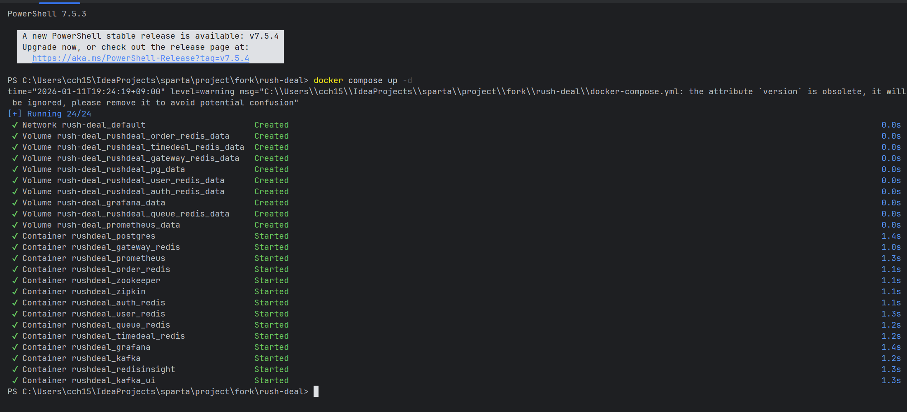

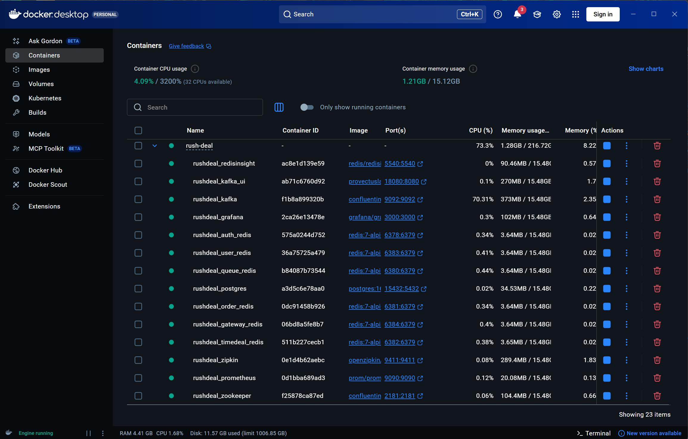


### 2.2 테스트 폴더로 경로 이동
**Windows**
```bash
cd order-service/k6/scripts

# Windows PowerShell에서 WSL 실행
wsl
```

**MacOS**
```bash
cd order-service/k6/scripts
```

### 2.3 .sh 파일 권한 주기

```bash
chmod +x *.sh
```

### 2.4 인프라 헬스체크

자동화 스크립트에 포함되어 있지만, 수동으로도 확인 가능합니다:

```bash
# order-service/k6/scripts 경로에서 실행
chmod +x check-infrastructure.sh
./check-infrastructure.sh
```

**예상 출력:**
```
🔍 Checking infrastructure...

PostgreSQL: ✅
Redis (auth): ✅
Redis (user): ✅
Redis (queue): ✅
Redis (order): ✅
Redis (timedeal): ✅
Redis (gateway): ✅
Kafka: ✅
Prometheus: ✅
Grafana: ✅

✅ All required infrastructure is ready!
```

### 2.5 애플리케이션 환경변수 설정
**루트 경로에 .env 파일 생성 후 각 애플리케이션 구성편집에서 환경변수 적용**

```
# .env 파일

# ============================================
# Spring Profile
# ============================================
SPRING_PROFILES_ACTIVE=local

# ============================================
# Database (PostgreSQL) - Docker 컨테이너
# ============================================
DB_URL=jdbc:postgresql://localhost:15432/rushdeal
DB_USERNAME=rushdeal
DB_PASSWORD=rushdeal

# JPA Settings
JPA_DDL_AUTO=update
SHOW_SQL=true
SQL_INIT_MODE=never

# ============================================
# Redis - Docker 컨테이너 (각각 다른 호스트 포트)
# ============================================
# API Gateway & 공통
REDIS_HOST=localhost
REDIS_PORT=6380
REDIS_PASSWORD=

# Auth Service
AUTH_REDIS_HOST=localhost
AUTH_REDIS_PORT=6378

# User Service
USER_REDIS_HOST=localhost
USER_REDIS_PORT=6383

# Order Service
ORDER_REDIS_HOST=localhost
ORDER_REDIS_PORT=6381

# Queue Service
QUEUE_REDIS_HOST=localhost
QUEUE_REDIS_PORT=6380

# Timedeal Service
TIMEDEAL_REDIS_HOST=localhost
TIMEDEAL_REDIS_PORT=6382

# ============================================
# Kafka - Docker 컨테이너
# ============================================
KAFKA_BROKERS=localhost:9092

# ============================================
# Eureka - IntelliJ에서 실행
# ============================================
EUREKA_URL=http://localhost:8761/eureka/
EUREKA_ENABLED=true

# ============================================
# JWT Secrets (개발용)
# ============================================
JWT_ACCESS_EXPIRED=60480000
JWT_ACCESS_SECRET=N6WSY55g7gYEPvCAazUfZw/DkMLlOyzotH1xCju5L78=
JWT_REFRESH_EXPIRED=120960000
JWT_REFRESH_SECRET=tbfb4D86amt6/7x5KHuVl7rzZXfs40IV6FWimTzImuQ=

# ============================================
# Auth Service
# ============================================
AUTH_MAX_CONCURRENT_SESSIONS=3

# ============================================
# Service Ports (IntelliJ에서 실행)
# ============================================
API_GATEWAY_PORT=8080
AUTH_SERVER_PORT=8000
USER_SERVER_PORT=8060
ORDER_SERVER_PORT=8050
PAYMENT_SERVER_PORT=8010
PRODUCT_SERVER_PORT=8020
QUEUE_SERVER_PORT=8040
TIMEDEAL_SERVER_PORT=8030

# ============================================
# PortOne (PG 결제)
# ============================================
PORTONE_API_SECRET=PdbdC9D9u0VE0sU2cQXTOMLdTYEJZJholVo5xO6MW0APy37t3YXkHGz2BKNH0cUv2WFNRtD7RxnmKTWc
PORTONE_WEBHOOK=whsec_FdNwj288RhKYUr3xhnGbyGZJM/bKRUdUsgMpq4zr4TE=
PORTONE_CHANNEL_KEY=channel-key-e557d17d-e040-40e9-a5fd-28018b0ee382
PORTONE_STORE_ID=store-03451ff4-921e-460b-95ae-8691178056a5

# ============================================
# 로컬 개발 전용
# ============================================
SQL_LOG_LEVEL=DEBUG
SQL_TYPE_LOG_LEVEL=TRACE
 
```

### 2.6 애플리케이션 실행
```
DiscoveryServiceApplication     :8761/
UserServiceApplication          :8060/
ProductServiceApplication       :8020/
TimeDealApplication             :8030/
QueueServiceApplication         :8040/
OrderServiceApplication         :8050/
```
**DB 스키마 생성을 위해 실행**

---

## 3. 테스트 데이터 생성

### 3.1 사용자 및 포인트 데이터 생성

**sql 파일 위치:** `order-service/k6/scripts/test-data.sql`

```bash
# order-service/k6/scripts 경로에서 실행
# 테스트 데이터 생성 (자동화 스크립트 실행 전 수동 실행)
docker exec -i rushdeal_postgres psql -U rushdeal -d rushdeal < test-data.sql
```

**생성되는 데이터:**
- `USER` 역할: 100명 (testuser1@test.com ~ testuser100@test.com)
- `SELLER` 역할: 1명 (seller@test.com)
- `MASTER` 역할: 1명 (master@test.com)
- 각 USER에게 10,000 포인트 지급

**예상 출력:**
```
============================================
🔧 RushDeal User & Point Test Data Init START
============================================

👤 [1/3] Creating test users (USER x100)...
DO
✅ USER 100명 생성 완료

🏪 Creating test seller...
INSERT 0 1
✅ SELLER 생성 완료

🏪 Creating test seller...
INSERT 0 1
✅ MASTER 생성 완료

💰 [3/3] Initializing points (10,000 per user)...
INSERT 0 100
✅ USER 100명 포인트 10,000 지급 완료

📊 User Summary
  role  | count 
--------+-------
 SELLER |     1
 MASTER |     1
 USER   |   100
(3 rows)


📊 Point Summary
 users_with_point | total_points 
------------------+--------------
              100 |      1000000
(1 row)


============================================
🎉 User & Point Test Data Init COMPLETED
============================================
```

### 3.2 데이터 검증

```bash
# 사용자 수 확인
docker exec rushdeal_postgres psql -U rushdeal -d rushdeal -c "
SELECT '👥 Test Users: ' || COUNT(*) AS test_users 
FROM user_schema.p_user 
WHERE role = 'USER';
"

# 포인트 확인
docker exec rushdeal_postgres psql -U rushdeal -d rushdeal -c "
SELECT '💰 Total Points: ' || SUM(balance_after) AS total_points 
FROM user_schema.p_point_history 
WHERE type = 'EARN_CONFIRM';
"
```

**예상 출력:**
```
     test_users     
--------------------
 👥 Test Users: 100
(1 row)
```
```
       total_points       
--------------------------
 💰 Total Points: 1000000
(1 row)
```

---

## 4. 상품 및 타임딜 설정

### 4.1 상품 * 상품 옵션 생성 (Postman 또는 curl)

**요청 (Postman):**
```http
POST http://localhost:8020/api/v1/products
Content-Type: application/json
X-User-Id: 102
X-User-Email: master@test.com
X-User-Role: MASTER

{
  "sellerId": 101,
  "companyName": "나이키코리아",
  "productName": "후드집업",
  "description": "우먼스 기모 후드집업",
  "price": 119000,
  "category": "CLOTHES",
  "optionRequests": [
    {"size": "S", "color": "빨강"},
    {"size": "S", "color": "파랑"},
    {"size": "M", "color": "빨강"},
    {"size": "M", "color": "파랑"}
  ]
}
```

**또는 curl:**
```bash
curl -X POST http://localhost:8020/api/v1/products \
  -H "Content-Type: application/json" \
  -H "X-User-Id: 102" \
  -H "X-User-Email: master@test.com" \
  -H "X-User-Role: MASTER" \
  -d '{
    "sellerId": 101,
    "companyName": "나이키코리아",
    "productName": "후드집업",
    "description": "우먼스 기모 후드집업",
    "price": 119000,
    "category": "CLOTHES",
    "optionRequests": [
      {"size": "S", "color": "빨강"},
      {"size": "S", "color": "파랑"},
      {"size": "M", "color": "빨강"},
      {"size": "M", "color": "파랑"}
    ]
  }'
```
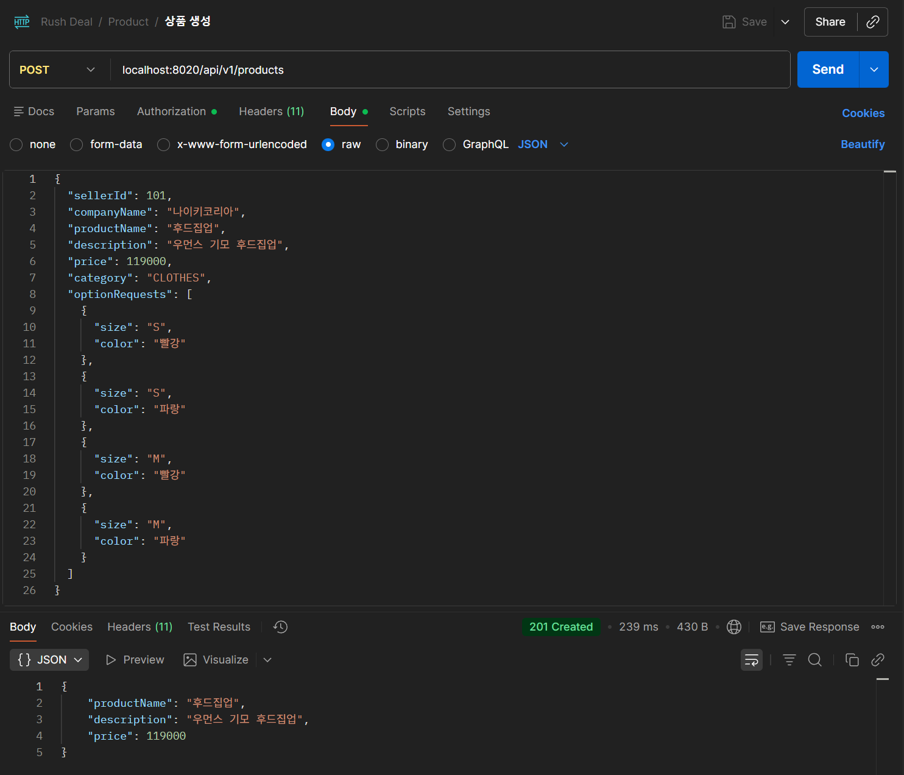

**DB에서`productId` 확인**

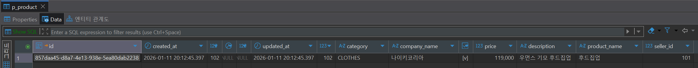

**상품 생성 시 상품 옵션도 함께 생성됨**

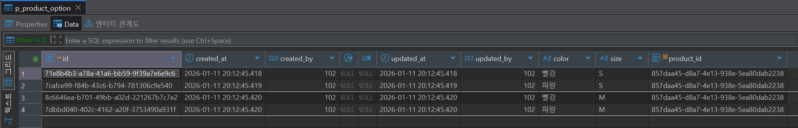

### 4.2 타임딜 & 타임딜 상품 생성

**요청 (Postman):**
```http
POST http://localhost:8030/api/v1/timedeals
Content-Type: application/json
X-User-Id: 102
X-User-Email: master@test.com
X-User-Role: MASTER

{
  "title": "나이키 타임딜",
  "description": "20% 할인가 진행",
  "discountPrice": 95200,
  "limitQuantity": 5,
  "startAt": "2026-01-07T02:15:00Z",
  "endAt": "2026-12-30T23:59:59Z",
  "status": "IN_PROGRESS",
  "productId": "{{productId}}"
}
```

**또는 curl (productId 교체 필요):**
```bash
curl -X POST http://localhost:8030/api/v1/timedeals \
  -H "Content-Type: application/json" \
  -H "X-User-Id: 102" \
  -H "X-User-Email: master@test.com" \
  -H "X-User-Role: MASTER" \
  -d '{
    "title": "나이키 타임딜",
    "description": "20% 할인가 진행",
    "discountPrice": 95200,
    "limitQuantity": 5,
    "startAt": "2026-01-07T02:15:00Z",
    "endAt": "2026-12-30T23:59:59Z",
    "status": "IN_PROGRESS",
    "productId": "YOUR_PRODUCT_ID_HERE"
  }'
```
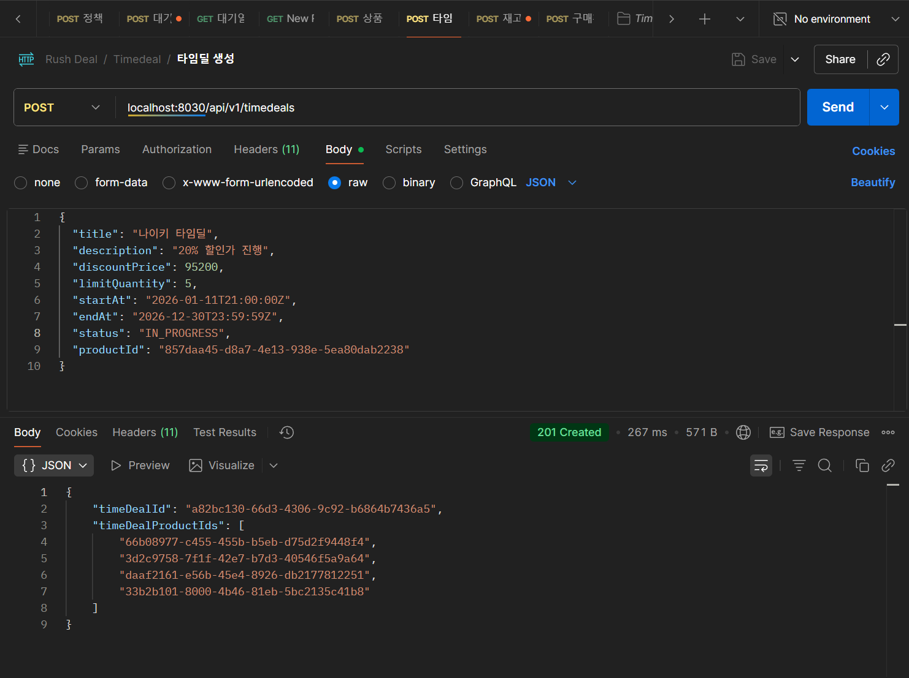

**DB에서 `timeDealId`, `timeDealProductId` 확인**

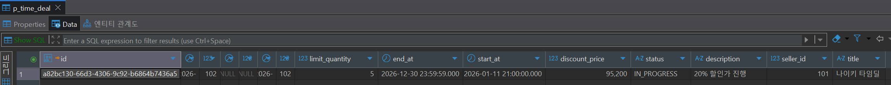

**타임딜 생성 시 타임딜 상품도 함께 생성됨**

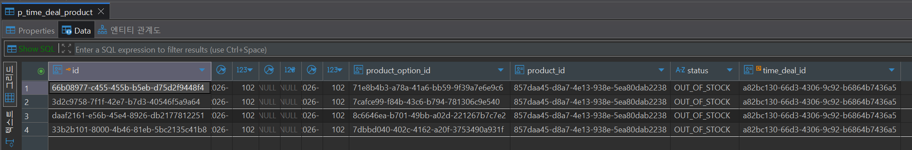

### 4.3 재고 생성 (4개의 타임딜 상품에 대해)

먼저 타임딜 상품 ID들을 조회:

```bash
# 타임딜 상품 ID 조회
docker exec rushdeal_postgres psql -U rushdeal -d rushdeal -c "
SELECT id FROM time_deal_schema.p_time_deal_product 
WHERE time_deal_id = 'YOUR_TIMEDEAL_ID_HERE' 
ORDER BY created_at;
"
```

각 타임딜 상품에 대해 재고 생성:

**요청 (Postman - 4번 반복):**
```http
POST http://localhost:8030/api/v1/stocks
Content-Type: application/json
X-User-Id: 102
X-User-Email: master@test.com
X-User-Role: MASTER

{
  "productId": "{{timeDealProductId}}",
  "totalStock": 100
}
```

**또는 curl (각 타임딜 상품 ID로 4번 실행):**
```bash
curl -X POST http://localhost:8030/api/v1/stocks \
  -H "Content-Type: application/json" \
  -H "X-User-Id: 102" \
  -H "X-User-Email: master@test.com" \
  -H "X-User-Role: MASTER" \
  -d '{
    "productId": "TIMEDEAL_PRODUCT_ID_1",
    "totalStock": 100
  }'
```
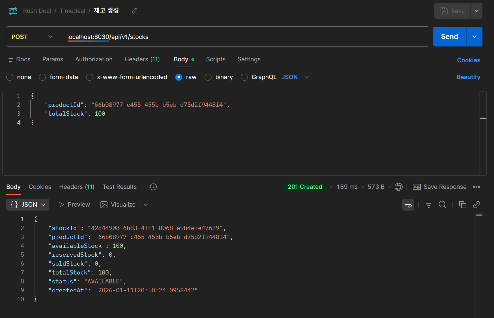

**DB에서 `timeDealStockId` 확인**

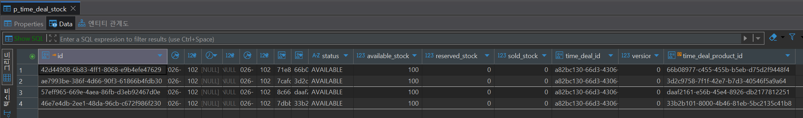

### 4.4 대기열 정책 생성

**요청 (Postman):**
```http
POST http://localhost:8040/api/v1/queue/policies
Content-Type: application/json
X-User-Id: 102
X-User-Role: MASTER

{
  "productId": "{{productId}}",
  "dealName": "신규 타임딜 이벤트",
  "status": "RUNNING",
  "startTime": "2026-01-01T00:00:00",
  "endTime": "2026-12-30T23:59:59",
  "maxCapacity": 10000,
  "limitSize": 100,
  "queueGap": 2,
  "ttl": 36000
}
```

**또는 curl:**
```bash
curl -X POST http://localhost:8040/api/v1/queue/policies \
  -H "Content-Type: application/json" \
  -H "X-User-Id: 102" \
  -H "X-User-Role: MASTER" \
  -d '{
    "productId": "YOUR_PRODUCT_ID_HERE",
    "dealName": "신규 타임딜 이벤트",
    "status": "RUNNING",
    "startTime": "2026-01-01T00:00:00",
    "endTime": "2026-12-30T23:59:59",
    "maxCapacity": 10000,
    "limitSize": 100,
    "queueGap": 2,
    "ttl": 36000
  }'
```

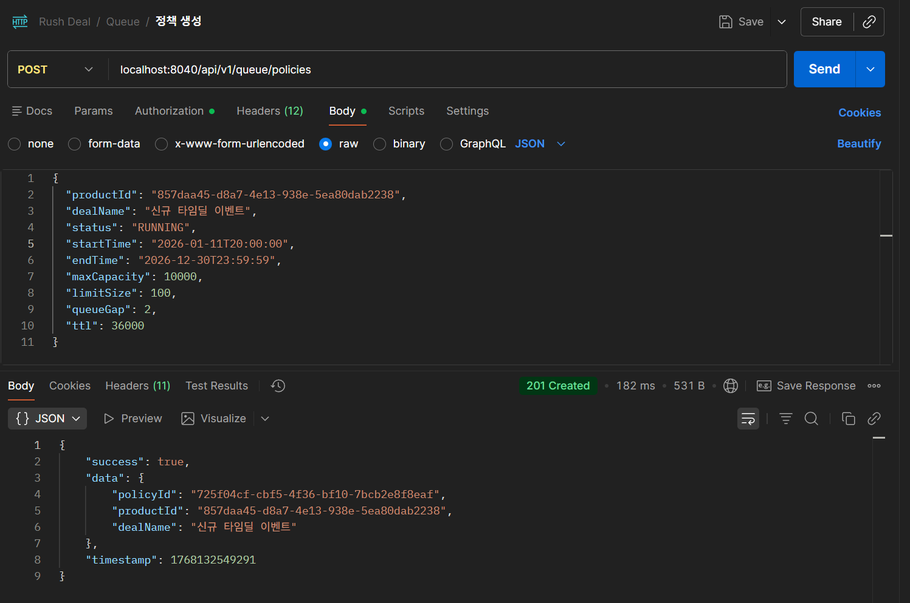

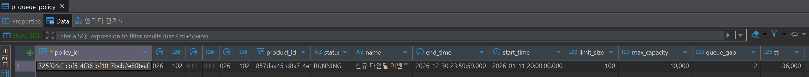

### 4.5 ID 확인

생성된 ID들을 확인:

```bash
cd order-service/k6/scripts
chmod +x get-test-ids.sh
./get-test-ids.sh
```

**예상 출력:**
```
📋 Test Data IDs
================

🛍️ Product ID:
857daa45-d8a7-4e13-938e-5ea80dab2238

⏰ TimeDeal ID:
a82bc130-66d3-4306-9c92-b6864b7436a5

📦 TimeDeal Product IDs:
66b08977-c455-455b-b5eb-d75d2f9448f4
3d2c9758-7f1f-42e7-b7d3-40546f5a9a64
daaf2161-e56b-45e4-8926-db2177812251
33b2b101-8000-4b46-81eb-5bc2135c41b8

📦 Stock IDs:
42d44908-6b83-4ff1-8068-e9b4efe47629
ae7993be-386f-4d66-90f3-61866b4fdb30
57eff965-669e-4aea-86fb-d3eb92467d0e
46e7e4db-2ee1-48da-96cb-c672f986f230

✅ Done!
```

---

## 5. 자동화 테스트 실행

### 5.1 자동화 스크립트 개요

`run-order-flow-validation-test.sh` 스크립트는 다음 작업들을 자동으로 수행합니다:

1. ✅ 인프라 헬스체크
2. 🧹 기존 테스트 데이터 정리 (선택사항)
3. 📋 Kafka 토픽 생성
4. 🔍 테스트 ID 조회 (Product, TimeDeal, Stock)
5. 🎫 큐 토큰 발급 (100개)
6. 🚀 주문 테스트 실행 (100명 동시 주문)
7. 📊 초기 검증 (주문 생성 확인)
8. ⏳ 자동 취소 대기 (7분)
9. 📊 최종 검증 (주문 자동 취소 및 재고 복구 확인)

### 5.2 스크립트 실행

**Windows**
```bash
# order-service/k6/scripts 경로에서 실행

# 실행 권한 부여
chmod +x run-order-flow-validation-test.sh

# 스크립트 실행
./run-order-flow-validation-test.sh
```

**MacOs**
```bash
# order-service/k6/scripts 경로에서 실행

# 실행 권한 부여
chmod +x run-order-flow-validation-test-mac.sh

# 스크립트 실행
./run-order-flow-validation-test-mac.sh
```

### 5.3 실행 중 인터랙션

스크립트 실행 중 다음과 같은 프롬프트가 나타납니다:

#### 1) IP 주소 감지
```
ℹ️  Detecting WSL IP address...
✅ WSL IP detected: 172.30.1.100
✅ Services will use: 172.30.1.100 (Queue:8040, Order:8050)
```

IP가 자동 감지되지 않으면 수동 입력을 요청합니다.

#### 2) 기존 데이터 정리
```
🧹 Clean existing test data? (y/N)
```

- `y`: 기존 주문/재고 데이터 삭제 후 진행
- `N` (기본): 기존 데이터 유지

#### 3) 주문 테스트 시작
```
⚠️  This will create 100 orders (~70% expected to succeed, ~30% to fail due to purchase limit)

▶️  Press Enter to start load test...
```

Enter 키를 눌러 테스트 시작

#### 4) 주문 생성 실패 시
만약 주문이 생성되지 않았다면:

```
❌ No orders found in database!
⚠️ This indicates order creation failed.

Continue verification anyway? (y/N):
```

- IntelliJ에서 Order Service가 실행 중인지 확인
- `y`를 눌러 계속 진행하거나 `N`으로 중단

### 5.4 자동 대기 과정

스크립트는 다음 과정을 자동으로 진행합니다:

```
⚠️  Step 10: Waiting for auto-cancellation...
ℹ️  Waiting 5 minutes for pending order timeout...
ℹ️  Then waiting 2 more minutes for scheduler execution...

⏳ Remaining: 07:00
```

**대기 시간:**
- 5분: PENDING 주문 타임아웃 대기
- 2분: 스케줄러 실행 여유 시간
- **총 7분**

---

## 6. 결과 분석

### 6.1 자동 생성되는 결과 파일

스크립트 실행 완료 후 `order-service/k6/outputs/` 디렉토리에 다음 파일들이 생성됩니다:

```
k6/outputs/
├── initial-verification.log      # ⭐ 주문 생성 검증 결과
├── final-verification.log        # ⭐ 주문 취소 검증 결과
├── stock-comparison.txt          # ⭐ 재고 변화 비교
├── queue-tokens-output.log       # 큐 토큰 발급 로그
└── load-test-output.log          # ⭐ k6 주문 테스트 로그
```

### 6.2 재고 비교 리포트 확인 (⭐ 중요)

```bash
cat order-service/k6/outputs/stock-comparison.txt
```

**예상 출력:**
```
========================================
📦 STOCK COMPARISON REPORT
========================================

🕐 Part 1: After Order Creation (Step 8)
Captured at: 2026-01-11 21:04:39

Stock ID                               | Available |  Reserved |      Sold |     Total
----------------------------------------|-----------|-----------|-----------|----------
42d44908-6b83-4ff1-8068-e9b4efe47629   |        53 |        47 |         0 |       100
46e7e4db-2ee1-48da-96cb-c672f986f230   |        40 |        60 |         0 |       100
57eff965-669e-4aea-86fb-d3eb92467d0e   |        42 |        58 |         0 |       100
ae7993be-386f-4d66-90f3-61866b4fdb30   |        46 |        54 |         0 |       100

==========================================

🕐 Part 2: After Auto-Cancellation (Step 10)
Captured at: 2026-01-11 21:12:15

Stock ID                               | Available |  Reserved |      Sold |     Total
----------------------------------------|-----------|-----------|-----------|----------
42d44908-6b83-4ff1-8068-e9b4efe47629   |       100 |         0 |         0 |       100
46e7e4db-2ee1-48da-96cb-c672f986f230   |       100 |         0 |         0 |       100
57eff965-669e-4aea-86fb-d3eb92467d0e   |       100 |         0 |         0 |       100
ae7993be-386f-4d66-90f3-61866b4fdb30   |       100 |         0 |         0 |       100

==========================================
📊 COMPARISON SUMMARY
==========================================

Stock ID                               | Before(A/R) | After(A/R)  | Status
----------------------------------------|-------------|-------------|------------
42d44908-6b83-4ff1-8068-e9b4efe47629   |    53 / 47   |   100 / 0    | ✅ RESTORED
46e7e4db-2ee1-48da-96cb-c672f986f230   |    40 / 60   |   100 / 0    | ✅ RESTORED
57eff965-669e-4aea-86fb-d3eb92467d0e   |    42 / 58   |   100 / 0    | ✅ RESTORED
ae7993be-386f-4d66-90f3-61866b4fdb30   |    46 / 54   |   100 / 0    | ✅ RESTORED

Legend: A=Available, R=Reserved, S=Sold
✅ RESTORED: Reserved stock returned to available
⚠️ RESERVED: Still has reserved stock
❌ MISMATCH: Available stock doesn't match original
```

### 6.3 주문 상태 확인

```bash
docker exec rushdeal_postgres psql -U rushdeal -d rushdeal -c "
SELECT 
    status,
    COUNT(*) as count,
    ROUND(COUNT(*)::numeric / SUM(COUNT(*)) OVER () * 100, 1) as percentage
FROM order_schema.p_order
GROUP BY status
ORDER BY count DESC;
"
```

**예상 출력:**
```
   status    | count | percentage
-------------+-------+------------
 CANCELLED   |    70 |       70.0
 FAILED      |    30 |       30.0
```

- `CANCELLED`: 정상 주문 후 타임아웃으로 취소된 주문 (~70%)
- `FAILED`: 구매 제한 초과로 실패한 주문 (~30%)

### 6.4 포인트 트랜잭션 확인

```bash
docker exec rushdeal_postgres psql -U rushdeal -d rushdeal -c "
SELECT 
    type,
    COUNT(*) as count,
    SUM(amount) as total_amount
FROM user_schema.p_point_history
WHERE type IN ('USE_PENDING', 'USE_CANCEL', 'EARN_PENDING')
GROUP BY type
ORDER BY 
    CASE type
        WHEN 'USE_PENDING' THEN 1
        WHEN 'USE_CANCEL' THEN 2
        WHEN 'EARN_PENDING' THEN 3
    END;
"
```

**예상 출력:**
```
    type     | count | total_amount 
-------------+-------+--------------
 USE_PENDING |    73 |        73000
 USE_CANCEL  |    73 |        73000
(2 rows)
```

- `USE_PENDING`: 주문 시 차감된 포인트 (1,000원 × 70건)
- `USE_CANCEL`: 취소로 환불된 포인트 (1,000원 × 70건)

### 6.5 검증 로그 상세 확인

**주문 생성 검증:**
```bash
cat order-service/k6/outputs/initial-verification.log
```

**주문 자동 취소 검증:**
```bash
cat order-service/k6/outputs/final-verification.log
```

### 6.6 Quick Summary (스크립트 실행 완료 시 자동 출력)

스크립트 완료 시 다음과 같은 요약 정보가 출력됩니다:

```
💡 Quick Summary:

📊 1. ORDER STATUS
  status   | count | percentage 
-----------+-------+------------
 CANCELLED |    73 |      100.0
(1 row)


💰 2. POINT TRANSACTION
    type     | count | total_amount 
-------------+-------+--------------
 USE_PENDING |    73 |        73000
 USE_CANCEL  |    73 |        73000
(2 rows)


📦 3. STOCK COMPARISON

========================================
📦 STOCK COMPARISON REPORT
========================================

🕐 Part 1: After Order Creation (Step 8)
Captured at: 2026-01-11 21:04:39

Stock ID                               | Available |  Reserved |      Sold |     Total
----------------------------------------|-----------|-----------|-----------|----------
42d44908-6b83-4ff1-8068-e9b4efe47629   |        53 |        47 |         0 |       100
46e7e4db-2ee1-48da-96cb-c672f986f230   |        40 |        60 |         0 |       100
57eff965-669e-4aea-86fb-d3eb92467d0e   |        42 |        58 |         0 |       100
ae7993be-386f-4d66-90f3-61866b4fdb30   |        46 |        54 |         0 |       100

==========================================

🕐 Part 2: After Auto-Cancellation (Step 10)
Captured at: 2026-01-11 21:12:15

Stock ID                               | Available |  Reserved |      Sold |     Total
----------------------------------------|-----------|-----------|-----------|----------
42d44908-6b83-4ff1-8068-e9b4efe47629   |       100 |         0 |         0 |       100
46e7e4db-2ee1-48da-96cb-c672f986f230   |       100 |         0 |         0 |       100
57eff965-669e-4aea-86fb-d3eb92467d0e   |       100 |         0 |         0 |       100
ae7993be-386f-4d66-90f3-61866b4fdb30   |       100 |         0 |         0 |       100
```

---

## 7. 문제 해결

### 7.1 일반적인 문제

#### 1) IP 자동 감지 실패

**증상:**
```
❌ Failed to detect WSL IP address
```

**해결:**
- Windows
```bash
# Windows PowerShell에서 IP 확인
ipconfig | findstr IPv4

# 수동으로 입력
Enter your WSL IP address (e.g., 172.30.1.72): 172.30.1.xxx
```

- MacOS
```bash
# IP 확인
ipconfig getifaddr en0

# 수동으로 입력
```

#### 2) 주문이 생성되지 않음

**증상:**
```
❌ No orders found in database!
```

**원인 및 해결:**

1. **Order Service 미실행**
   ```bash
   # 포트 확인
   netstat -tuln | grep 8050
   
   # ❌ 출력 없음 → IntelliJ에서 Order Service 실행
   ```

2. **큐 토큰 발급 실패**
   ```bash
   # 토큰 수 확인
   wc -l k6/outputs/tokens.txt
   
   # 0개면 Queue Service 확인
   curl http://localhost:8040/actuator/health
   ```

3. **Product/TimeDeal ID 오류**
   ```bash
   # ID 재확인
   cd order-service/k6/scripts
   ./get-test-ids.sh
   ```

#### 3) 통계 결과 로그가 DB와 일치하지 않음

**증상:**
```
-- 📦 1. ORDER STATISTICS
PENDING | 28 | 7,711,200원 | 28,000 포인트

-- 📦 1-1. RECENT 100 ORDERS  
PENDING | 31 | 8,472,800원 | 31,000 포인트

-- 📊 2. ORDER ITEMS
orders_with_items: 32 | total_items: 59 | total_quantity: 94

-- 💰 3. POINT USAGE
USE_PENDING | 34건 | 34,000원

-- 📦 8. STOCK RESERVATION
총 예약 재고: 64 + 69 + 58 + 49 = 240개
```

**원인:**

트랜잭션 커밋 지연으로 인한 조회 시점 불일치로 예약은 성공했지만 주문 생성이 아직 완료되지 않았을 가능성이 높습니다.

**해결:**
```bash
# 현재: sleep 5
# 권장: 10~15초 대기 후 조회
sleep 15
```

#### 4) 재고가 복구되지 않음

**증상:**
```
Stock ID                               | Before(A/R) | After(A/R) | Status
----------------------------------------|-------------|------------|------------
xxxxxxxx-xxxx-xxxx-xxxx-xxxxxxxxxxxx   |  55 /  45   |  55 /  45  | ⚠️ RESERVED
```

**원인 및 해결:**

1. **스케줄러 미실행**
    - IntelliJ에서 Order Service 로그 확인
    - `@Scheduled` 어노테이션 활성화 확인

2. **Kafka Consumer 오류**
   ```bash
   # Kafka 로그 확인
   docker logs rushdeal_kafka | tail -50
   
   # 토픽 메시지 확인
   docker exec rushdeal_kafka kafka-console-consumer \
     --bootstrap-server localhost:9092 \
     --topic order.cancelled \
     --from-beginning \
     --max-messages 10
   ```

3. **대기 시간 부족**
   ```bash
   # 추가로 2분 더 대기 후 재확인
   sleep 120
   cat k6/outputs/stock-comparison.txt
   ```

### 7.2 로그 확인

```bash
# 서비스별 로그 확인
docker logs rushdeal_order_service --tail 100
docker logs rushdeal_queue_service --tail 100
docker logs rushdeal_kafka --tail 100

# 실시간 로그 모니터링
docker logs -f rushdeal_order_service
```

### 7.3 데이터베이스 초기화

테스트 재실행 전 데이터 정리:

```bash
# 주문 및 포인트 데이터 삭제
docker exec rushdeal_postgres psql -U rushdeal -d rushdeal -c "
TRUNCATE TABLE order_schema.p_order CASCADE;
DELETE FROM user_schema.p_point_history WHERE type != 'EARN_CONFIRM';
"

# 재고 초기화
docker exec rushdeal_postgres psql -U rushdeal -d rushdeal -c "
UPDATE time_deal_schema.p_time_deal_stock
SET available_stock = 100,
    reserved_stock = 0,
    sold_stock = 0;
"
```

또는 `run-order-flow-validation-test.sh` 실행 시 데이터 정리 옵션 선택:

```bash
./run-order-flow-validation-test.sh

🧹 Clean existing test data? (y/N): y  ← 입력
```

### 7.4 컨테이너 재시작

인프라 전체 재시작이 필요한 경우:

```bash
# 전체 중지 및 볼륨 삭제 (루트 경로에서)
docker-compose down -v

# 재시작 (루트 경로에서)
docker-compose up -d

# 헬스체크
cd order-service/k6/scripts
./check-infrastructure.sh

# Kafka 토픽 재생성
cd order-service/k6/scripts
./create-kafka-topics.sh

# 테스트 데이터 재생성
cd order-service/k6/scripts
docker exec -i rushdeal_postgres psql -U rushdeal -d rushdeal < test-data.sql
```

### 7.5 스크립트 권한 오류

```bash
# 모든 스크립트에 실행 권한 부여
cd order-service/k6/scripts
chmod +x *.sh
```

### 7.6 k6 실행 타임아웃

**증상:**
```
❌ k6 execution timed out after 5 minutes
```

**해결:**
1. Queue Service 상태 확인
2. 네트워크 연결 확인
3. 타임아웃 시간 조정 (스크립트 내 `timeout 300` 수정)

---

## 📊 성공 기준

테스트가 성공적으로 완료되었다면:

✅ **주문 생성:**
- 약 70개 주문이 PENDING 상태로 생성
- 약 30개 주문이 구매 제한 초과로 실패

✅ **재고 예약:**
- Part 1에서 Reserved 재고가 증가
- Available 재고가 감소
- Total은 항상 100 유지

✅ **주문 자동 취소:**
- PENDING → CANCELLED 상태 변경
- 약 70개 주문 취소 완료

✅ **재고 복구:**
- Part 2에서 Reserved가 0으로 복구
- Available이 100으로 복구
- 모든 Stock이 ✅ RESTORED 상태

✅ **포인트 환불:**
- USE_PENDING == USE_CANCEL (건수 및 금액 일치)
- 사용자 포인트가 초기 상태로 복구

---

## 🎯 다음 단계

테스트 완료 후:

1. **Grafana 대시보드 확인**
    - http://localhost:3000
    - 메트릭 및 성능 지표 분석
    - JVM 메모리, CPU 사용률, 응답 시간 등 확인

2. **추가 테스트 시나리오**
    - 동시 접속자 수 조정 (`k6/tests/load-test-order.js`에서 `vus` 값 변경)
    - 상품 수량 변경 (더 많은 재고로 테스트)
    - 다양한 구매 패턴 시뮬레이션

3. **성능 튜닝**
    - 병목 구간 식별
    - 데이터베이스 쿼리 최적화
    - Redis 캐시 전략 개선
    - Kafka 파티션 조정

4. **테스트 결과 보고서 작성**
    - `k6/outputs/` 디렉토리의 로그 파일 활용
    - 주요 메트릭 정리
    - 개선 사항 도출

---

## 📚 참고 자료

- **k6 공식 문서:** https://k6.io/docs/
- **Docker Compose 가이드:** https://docs.docker.com/compose/
- **Kafka 운영 가이드:** https://kafka.apache.org/documentation/

---

## 💡 팁

- 테스트 전 항상 인프라 헬스체크 수행
- 로그 파일은 테스트마다 백업하여 비교 분석
- 재고 복구 실패 시 스케줄러 동작 확인 필수
- 대량 테스트 시 Docker 리소스 제한 조정 고려
