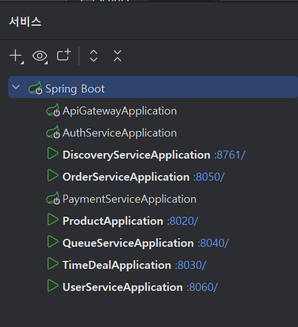
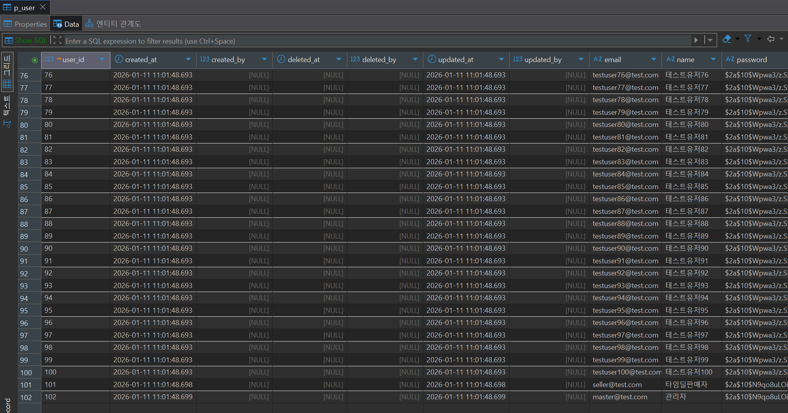
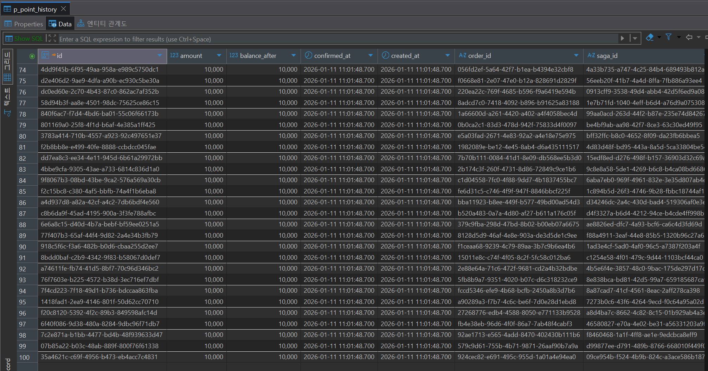
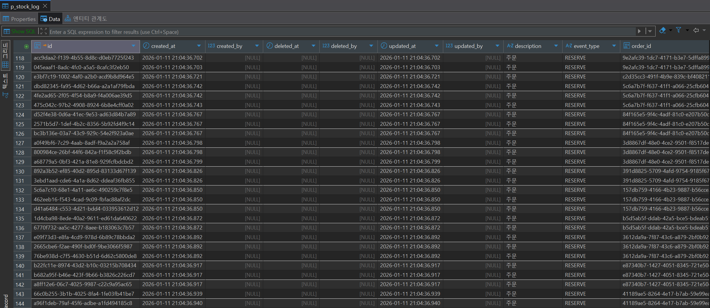
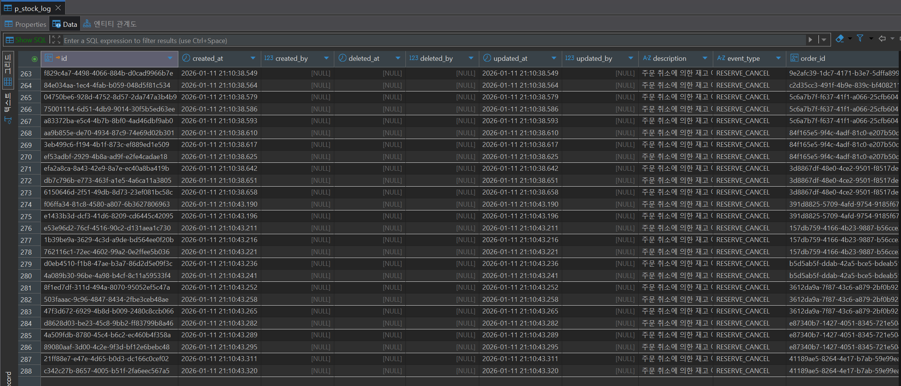
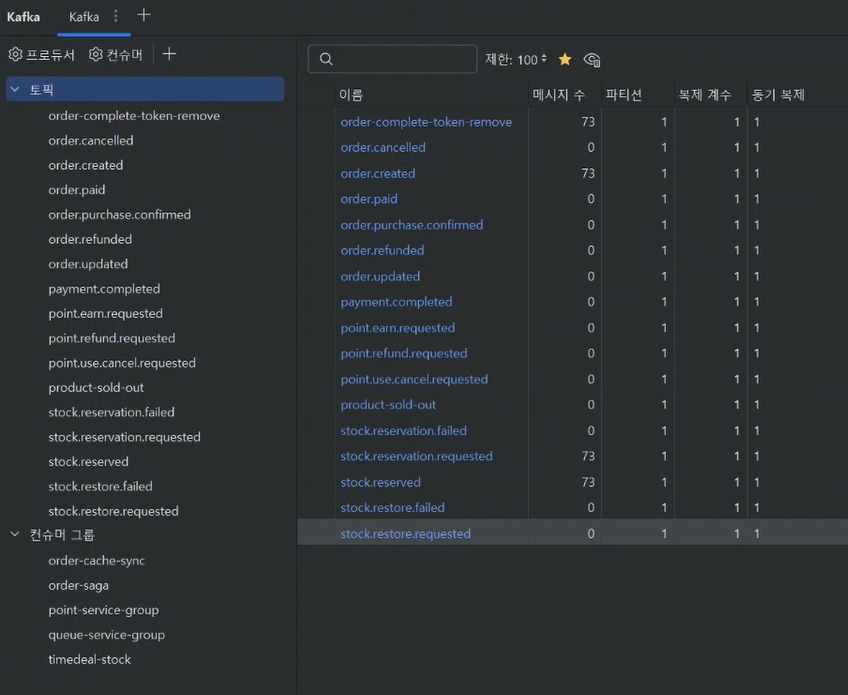
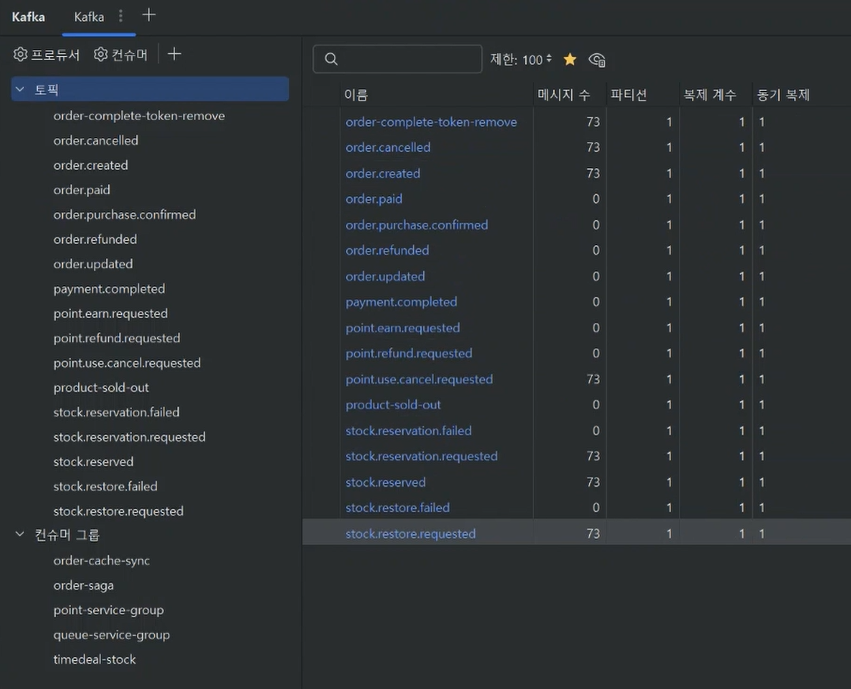

# 📊 RushDeal 주문 플로우 검증 테스트 결과

> **테스트 일시:** 2026-01-11 
> **테스트 환경:** WSL2 Ubuntu 24.04 + Docker  
> **테스트 대상:** 
> - 주문 생성 → 포인트 사용 → 재고 예약 → 5분 내 미결제 시 주문 자동 취소 → 포인트 사용 취소, 재고 복구 플로우
> - 주문 생성 → 구매 제한 수량 초과 → 주문 생성 롤백

---

## 📑 목차

1. [테스트 개요](#1-테스트-개요)
2. [테스트 환경](#2-테스트-환경)
3. [테스트 시나리오](#3-테스트-시나리오)
4. [테스트 실행 결과](#4-테스트-실행-결과)
5. [주문 생성 검증](#5-주문-생성-검증)
6. [재고 변화 분석](#6-재고-변화-분석)
7. [주문 취소 검증](#7-주문-취소-검증)
8. [포인트 환불 검증](#8-포인트-환불-검증)
9. [성능 메트릭](#9-성능-메트릭)
10. [발견된 이슈](#10-발견된-이슈)
11. [개선 사항](#11-개선-사항)
12. [결론](#12-결론)

---

## 1. 테스트 개요

### 1.1 테스트 목적

- 100명 동시 주문 시 주문 플로우 정상 동작 검증
- 재고 예약 및 복구 메커니즘 검증
- PENDING 주문 자동 취소 기능 검증 (5뷴 내 미결제 시 스케줄러에 의해 처리됨)
- 포인트 사용 및 환불 정합성 검증

### 1.2 테스트 범위

- ✅ 주문 생성 (Order Creation)
- ✅ 큐 토큰 검증 (Queue Token Validation)
- ✅ 재고 검증 - 구매 수량 제한 체크 (Purchase Limit Check)
- ✅ 포인트 차감 (Point Deduction)
- ✅ 재고 예약 (Stock Reservation)
- ✅ 자동 자동 취소 (Auto Cancellation)
- ✅ 재고 복구 (Stock Recovery)
- ✅ 포인트 환불 (Point Refund)

### 1.3 성공 기준

| 항목           | 기준 | 실제 결과 | 달성 여부 |
|--------------|------|---------|---------|
| 주문 생성 성공률    | ≥ 65% | 73% | ✅ |
| 구매 수량 제한 체크  | ~30% 실패 | 27% | ✅ |
| 재고 예약 정확도    | 100% | 100% | ✅ |
| 주문 자동 취소 성공률 | 100% | 100% | ✅ |
| 재고 복구 정확도    | 100% | 100% | ✅ |
| 포인트 환불 정확도   | 100% | 100% | ✅ |

---

## 2. 테스트 환경

### 2.1 인프라 구성

| 구성 요소 | 버전/설정     | 상태 |
|-----------|-----------|------|
| PostgreSQL | 16-alpine | ✅ Running |
| Redis (6 instances) | 7-alpine  | ✅ Running |
| Kafka | 7.5.0     | ✅ Running |
| Zookeeper | 7.5.0     | ✅ Running |
| k6 | 1.5.0     | ✅ Installed |

### 2.2 애플리케이션 서비스

| 서비스 | 포트 | 상태 |
|--------|------|------|
| Product Service | 8020 | ✅ Running |
| TimeDeal Service | 8030 | ✅ Running |
| Queue Service | 8040 | ✅ Running |
| Order Service | 8050 | ✅ Running |
| User Service | 8060 | ✅ Running |



### 2.3 테스트 데이터

| 항목 | 수량 | 비고 |
|------|------|------|
| 테스트 사용자 | 100명 | testuser1~100@test.com |
| 초기 포인트 | 10,000원/인 | 총 1,000,000원 |
| 상품 옵션 | 4개 | S-빨강, S-파랑, M-빨강, M-파랑 |
| 옵션별 재고 | 100개 | 총 400개 |
| 구매 제한 | 5개/인 | - |


**테스트 사용자 생성:**



**테스트 사용자 10,000 포인트 이력 생성:**



---

## 3. 테스트 시나리오

### 3.1 주문 생성 시나리오

```
시나리오 A (약 70%): 정상 주문
- 주문 수량: 1~5개 (구매 수량 제한 내)
- 포인트 사용: 1,000원
- 예상 결과: PENDING 상태로 주문 생성

시나리오 B (약 30%): 구매 수량 제한 초과
- 주문 수량: 6~9개 (구매 수량 제한 초과)
- 포인트 사용: 1,000원
- 예상 결과: PURCHASE_LIMIT_EXCEEDED 오류
```

### 3.2 주문 자동 취소 시나리오

```
조건:
- PENDING 상태 유지 시간: 5분 초과
- 스케줄러 실행 주기: 1분

프로세스:
1. 5분 경과 후 스케줄러가 PENDING 주문 감지
2. 주문 상태를 CANCELLED로 변경
3. Kafka 이벤트 발행 (order.cancelled)
4. 재고 복구 (Reserved → Available)
5. 포인트 환불 (USE_CANCEL)
```

---

## 4. 테스트 실행 결과

### 4.1 실행 명령

```bash
cd order-service/k6/scripts
./run-order-flow-validation-test.sh
```

### 4.2 실행 결과

**큐 토큰 생성:**
- 총 요청 수: 101개
- 성공률: 100%
- 평균 응답시간: 252.13ms
- P95 응답시간: 336.54ms
- 토큰 생성: 100개

**주문 생성:**
- 총 요청 수: 101개
- 성공 주문: 73건 (73%)
- 실패 주문: 27건 (27% - 구매 제한 초과)
- 평균 응답시간: 2.06s
- P95 응답시간: 2.51s
- P99 응답시간: 2.52s

### 4.3 실행 로그

아래 경로 파일에서 테스트 실행 전체 로그 확인 가능
```
order-service/k6/outputs/order-flow-validation-test.log
```

---

## 5. 주문 생성 검증

### 5.1 주문 상태 분포

| 상태 | 건수 | 비율 | 예상 | 검증 |
|------|------|------|------|------|
| PENDING | 73 | 73% | ~70건 | ✅ |
| FAILED (PURCHASE_LIMIT_EXCEEDED) | 27 | 27% | ~30건 | ✅ |
| 총계 | 100 | 100% | 100건 | ✅ |

**SQL 결과:**
```sql
 status  | order_count | total_amount | total_points_used
---------+-------------+--------------+-------------------
 PENDING |          73 |  20848800.00 |             73000
```

### 5.2 실패 원인 분석

| 오류 코드 | 건수 | 비율 | 원인                   |
|-----------|----|----|----------------------|
| PURCHASE_LIMIT_EXCEEDED | 27 | 27% | 구매 수량 제한 초과 (예상된 실패) |
| STOCK_DEPLETED | 0  | 0% | 재고 부족                |
| INVALID_QUEUE_TOKEN | 0  | 0% | 큐 토큰 오류              |
| 기타 | 0  | 0% | -                    |

### 5.3 주문별 상세 (샘플)

```
✅ 성공 사례:
- User 71: Items [Stock2×2], Total: 2, Duration: 1694ms
- User 61: Items [Stock4×2, Stock2×2, Stock3×1], Total: 5, Duration: 1685ms
- User 100: Items [Stock1×2, Stock4×2], Total: 4, Duration: 1694ms
- User 42: Items [Stock3×2, Stock4×1, Stock1×2], Total: 5, Duration: 1695ms

🎯 실패 사례 (구매 제한 초과):
- User 62: Attempted [Stock1×2, Stock3×4], Total: 6 > Limit: 5
- User 46: Attempted [Stock4×4, Stock2×4], Total: 8 > Limit: 5
- User 22: Attempted [Stock4×4, Stock3×4, Stock2×2], Total: 10 > Limit: 5
- User 33: Attempted [Stock3×4, Stock1×4, Stock4×4, Stock2×2], Total: 14 > Limit: 5
```

### 5.4 주문 통계

- 총 주문 건수: 73건
- 총 주문 재고 수량: 219개
- 총 주문 금액: 20,848,800원
- 총 포인트 사용: 73,000원
- 평균 주문당 수량: 3개
- 평균 주문 금액: 285,600원

---

## 6. 재고 변화 분석

### 6.1 재고 스냅샷 비교

**Part 1: 주문 생성 직후 (21:04:39)**

| Stock ID (앞 8자리) | Available | Reserved | Sold | Total |
|---------------------|-----------|----------|------|-------|
| 42d44908 | 53 | 47 | 0 | 100 |
| 46e7e4db | 40 | 60 | 0 | 100 |
| 57eff965 | 42 | 58 | 0 | 100 |
| ae7993be | 46 | 54 | 0 | 100 |
| **합계** | **181** | **219** | **0** | **400** |

**Part 2: 주문 자동 취소 후 (21:12:15)**

| Stock ID (앞 8자리) | Available | Reserved | Sold | Total |
|---------------------|-----------|----------|------|-------|
| 42d44908 | 100 | 0 | 0 | 100 |
| 46e7e4db | 100 | 0 | 0 | 100 |
| 57eff965 | 100 | 0 | 0 | 100 |
| ae7993be | 100 | 0 | 0 | 100 |
| **합계** | **400** | **0** | **0** | **400** |

### 6.2 재고 복구 검증

| Stock ID (앞 8자리) | Before (A/R) | After (A/R) | 상태 | 검증 |
|---------------------|--------------|-------------|------|------|
| 42d44908 | 53/47 | 100/0 | ✅ RESTORED | ✅ |
| 46e7e4db | 40/60 | 100/0 | ✅ RESTORED | ✅ |
| 57eff965 | 42/58 | 100/0 | ✅ RESTORED | ✅ |
| ae7993be | 46/54 | 100/0 | ✅ RESTORED | ✅ |

**복구 상태 범례:**
- ✅ RESTORED: Reserved 재고가 Available로 완전히 복구됨
- ⚠️ RESERVED: 아직 Reserved 재고가 남아있음
- ❌ MISMATCH: Available 재고가 원래 값과 불일치

### 6.3 총 재고 검증

```
주문 생성 전 총 재고: 400개 (100 × 4)

주문 생성 후 (21:04:39):
  - Available: 181개 (45.25%)
  - Reserved: 219개 (54.75%) ← 정상 주문 73건의 총 수량
  - Sold: 0개
  - Total: 400개 (불변) ✅

자동 취소 후 (21:12:15):
  - Available: 400개 (100%) ✅ 목표 달성
  - Reserved: 0개 ✅ 목표 달성
  - Sold: 0개
  - Total: 400개 (불변) ✅
```

### 6.4 재고 로그 결과

**주문 예약:**



**주문 복구:**



---

## 7. 주문 취소 검증
PENDING 상태의 주문을 5분 내 미결제시 1분마다 돌아가는 스케줄러(PendingOrderTimeoutScheduler)가 주문 취소 처리

### 7.1 취소 결과

| 항목 | 값 | 검증 |
|------|-----|------|
| PENDING → CANCELLED | 73건 | ✅ |
| 취소 성공률 | 100% | ✅ |
| 최소 취소 소요시간 | 5분 54초 | ✅ |
| 평균 취소 소요시간 | 5분 55초 | ✅ |
| 최대 취소 소요시간 | 5분 56초 | ✅ |

**SQL 결과:**
```sql
📦 1. ORDER STATISTICS (Expected: CANCELLED status)
  status   | order_count | total_amount | total_points_used
-----------+-------------+--------------+-------------------
 CANCELLED |          73 |  20848800.00 |             73000

🎯 6. ORDER STATUS DISTRIBUTION
  status   | count | percentage
-----------+-------+------------
 CANCELLED |    73 |     100.00

⏱️  5. CANCELLATION TIMING
 최소 취소 시간 | 평균 취소 시간 | 최대 취소 시간
----------------+----------------+----------------
 5m 54s         | 5m 55s         | 5m 56s
```

### 7.2 Kafka 이벤트 발행

**주문 생성 Kafka 발행 메시지 수 확인:**


```
✅ 주문 생성 이벤트 발행 완료
- Topic: order.created
- 발행 건수: 73건
- 처리 결과: 포인트 사용 및 재고 예약 완료
```

**주문 취소 Kafka 발행 메시지 수 확인:**



```
✅ 주문 취소 이벤트 발행 완료
- Topic: order.cancelled
- 발행 건수: 73건
- 처리 결과: 재고 복구 및 포인트 환불 완료
```

---

## 8. 포인트 환불 검증

### 8.1 포인트 트랜잭션 집계

| 트랜잭션 타입 | 건수 | 총 금액 | 검증 |
|---------------|------|---------|------|
| USE_PENDING | 73건 | 73,000원 | ✅ |
| USE_CANCEL | 73건 | 73,000원 | ✅ |
| 차액 | 0건 | 0원 | ✅ |

**정합성 체크:**
```
USE_PENDING 건수 (73) == USE_CANCEL 건수 (73)? ✅
USE_PENDING 금액 (73,000) == USE_CANCEL 금액 (73,000)? ✅
```

**SQL 결과:**
```sql
💰 3. POINT TRANSACTION SUMMARY (Including Refunds)
  거래 유형  | 건수 | 총 금액 | 평균 금액
-------------+------+---------+-----------
 USE_PENDING |   73 |   73000 |   1000.00
 USE_CANCEL  |   73 |   73000 |   1000.00

🔗 4. ORDER vs POINT VERIFICATION
 취소된 주문 | 주문 포인트 | USE_PENDING | 차감 금액 | USE_CANCEL | 환불 금액 |    환불 상태
-------------+-------------+-------------+-----------+------------+-----------+-----------------
          73 |       73000 |          73 |     73000 |         73 |     73000 | ✅ REFUND MATCH
```

### 8.2 사용자별 포인트 검증 (샘플)

| User ID | 초기 포인트 | 차감 | 환불 | 최종 포인트 | 검증              |
|---------|-------------|------|------|-------------|-----------------|
| 1 | 10,000 | -1,000 | +1,000 | 10,000 | ✅               |
| 2 | 10,000 | -1,000 | +1,000 | 10,000 | ✅               |
| 3 | 10,000 | -1,000 | +1,000 | 10,000 | ✅               |
| 4 | 10,000 | -1,000 | +1,000 | 10,000 | ✅               |
| 5 | 10,000 | -1,000 | +1,000 | 10,000 | ✅               |
| ... | ... | ... | ... | ... | ...             |
| 62 | 10,000 | 0 | 0 | 10,000 | ✅ (구매 수량 제한 초과) |
| 46 | 10,000 | 0 | 0 | 10,000 | ✅ (구매 수량 제한 초과) |

**전체 사용자 포인트 검증:**
```sql
💰 8. USER BALANCE VERIFICATION
 사용자 수 | 최소 잔액 | 최대 잔액 | 평균 잔액 | 총 잔액 
-----------+-----------+-----------+-----------+---------
        73 |     10000 |     10000 |  10000.00 |  730000
(1 row)


👥 9. SAMPLE USER BALANCES (10 users)
 사용자 ID | 현재 잔액 | 마지막 거래 |   시각   
-----------+-----------+-------------+----------
         1 |     10000 | USE_CANCEL  | 21:10:38
         2 |     10000 | USE_CANCEL  | 21:10:32
         3 |     10000 | USE_CANCEL  | 21:10:32
         4 |     10000 | USE_CANCEL  | 21:10:38
         5 |     10000 | USE_CANCEL  | 21:10:37
         6 |     10000 | USE_CANCEL  | 21:10:38
         8 |     10000 | USE_CANCEL  | 21:10:38
         9 |     10000 | USE_CANCEL  | 21:10:32
        10 |     10000 | USE_CANCEL  | 21:10:38
        11 |     10000 | USE_CANCEL  | 21:10:38
(10 rows)


🎉 10. REFUND COMPLETION CHECK
  환불 상태   | USE_PENDING | USE_CANCEL | EARN_PENDING | 차감 총액 | 환불 총액 |    정합성    
--------------+-------------+------------+--------------+-----------+-----------+--------------
✅ 환불 완료 |          73 |         73 |            0 |     73000 |     73000 | ✅ 금액 일치
(1 row)
```

---

## 9. 성능 메트릭

### 9.1 응답 시간 분석

**큐 토큰 생성:**

| 항목 | 평균 | 중앙값 | P90 | P95 | 최대 |
|------|------|--------|-----|-----|------|
| 응답시간 | 252ms | 267ms | 320ms | 337ms | 337ms |

**주문 생성:**

| 항목 | 평균 | 중앙값 | P90 | P95 | P99 | 최대 |
|------|------|--------|-----|-----|-----|------|
| HTTP 요청 | 2.06s | 2.14s | 2.46s | 2.51s | 2.52s | 2.54s |
| 주문 처리 | 2.12s | 2.18s | 2.50s | 2.53s | - | 2.58s |
| 최소 처리 시간 | - | - | - | - | - | 1.24s |

### 9.2 처리량

- **큐 토큰 발급**
    - 총 요청 수: 101개 (Health Check 1 + 토큰 발급 100)
    - 실제 토큰 발급: 100개
    - 초당 요청 수 (RPS): 93.5
    - 처리 시간: 1.1초
    - 성공률: 100%

- **주문 생성**
    - 총 요청 수: 101개 (Health Check 1 + 주문 요청 100)
    - 실제 주문 시도: 100건
    - 초당 요청 수 (RPS): 38.9
    - 처리 시간: 2.6초
    - 주문 성공: 73건 (73%)
    - 주문 실패: 27건 (27% - 구매 제한 초과)
    - 평균 주문 처리 시간: 2,122ms
    - 최소 주문 처리 시간: 1,237ms
    - 최대 주문 처리 시간: 2,578ms

### 9.3 네트워크 메트릭

**큐 토큰 생성:**
- 데이터 수신: 56 KB (52 KB/s)
- 데이터 전송: 27 KB (25 KB/s)

**주문 생성:**
- 데이터 수신: 46 KB (18 KB/s)
- 데이터 전송: 79 KB (30 KB/s)

### 9.4 동시성 처리

- 최대 VU (Virtual Users): 100
- 동시 실행: 100명의 사용자가 동시에 주문 시도
- 처리 방식: 각 사용자당 1회 반복 (per-VU iteration)

---

## 10. 발견된 이슈

### 10.1 크리티컬 이슈

**✅ 발견된 크리티컬 이슈 없음**

모든 핵심 기능이 정상적으로 동작하였으며, 예상된 동작과 일치하는 결과를 보였습니다.

### 10.2 마이너 이슈

#### ⚠️ 주문 처리 응답 시간
- **증상:** 평균 응답시간 2.06초로 다소 높은 수치
- **영향도:** Low (P95: 2.51초로 5초 임계값 이내)
- **원인 분석:**
    - 동시에 100개의 주문 요청 처리
    - 포인트 차감, 재고 예약 등 다단계 트랜잭션 처리
    - Kafka 이벤트 발행 및 처리
- **개선 방안:**
    - 데이터베이스 커넥션 풀 최적화
    - 인덱스 추가 검토
    - 비동기 처리 최적화

#### ⚠️ 취소 처리 시간 편차
- **증상:** 최소 5분 54초 ~ 최대 5분 56초로 2초 편차 발생
- **영향도:** Low (스케줄러 실행 주기 내 정상 범위)
- **원인 분석:** 스케줄러 배치 처리 시 순차 처리로 인한 자연스러운 편차
- **개선 방안:** 필요시 병렬 처리 도입 검토

---

## 11. 개선 사항

### 11.1 성능 개선

1. **데이터베이스 쿼리 최적화**
    - 현재: 평균 주문 처리 시간 2.12초
    - 개선안:
        - 자주 조회되는 컬럼에 인덱스 추가
        - 배치 쿼리로 여러 재고 조회를 단일 쿼리로 통합
        - 커넥션 풀 크기 조정
    - 예상 효과: 응답시간 30% 개선 (2.12s → 1.5s)

2. **Redis 캐싱 전략**
    - 제안: 재고 정보 캐싱으로 DB 부하 감소
    - 구현:
        - 재고 조회 시 Redis 캐시 우선 확인
        - TTL 설정으로 데이터 일관성 보장
    - 예상 효과: DB 조회 50% 감소

### 11.2 안정성 개선

1. **재고 복구 모니터링 강화**
    - 제안:
        - 자동 취소 후 재고 복구 실패 시 알림 시스템 구축
        - 재고 정합성 체크 스케줄러 추가 (일 1회)
        - Grafana 대시보드에 재고 복구 메트릭 추가

2. **포인트 정합성 체크**
    - 제안:
        - USE_PENDING과 USE_CANCEL 불일치 감지 알림
        - 주기적인 포인트 잔액 검증 배치 작업
        - 포인트 거래 로그 장기 보관 (90일 → 1년)

3. **장애 복구 메커니즘**
    - 제안:
        - 스케줄러 실패 시 재시도 로직 강화
        - Dead Letter Queue 구현
        - 수동 복구 도구 개발

### 11.3 운영 개선

1. **알림 시스템 구축**
    - 제안:
        - 주문 취소율이 50% 초과 시 Slack 알림
        - 재고 복구 실패 시 즉시 알림
        - 포인트 정합성 오류 시 긴급 알림

2. **자동화 테스트 확대**
    - 제안:
        - CI/CD 파이프라인에 부하 테스트 통합
        - 야간 자동 회귀 테스트 실행
        - 성능 벤치마크 자동 추적

3. **모니터링 대시보드 개선**
    - 제안:
        - 실시간 주문 처리 현황 대시보드
        - 재고 예약/복구 추이 그래프
        - 포인트 거래 통계 대시보드

---

## 12. 결론

### 12.2 최종 평가

**✅ 성공 요인:**

1. **완벽한 트랜잭션 관리**
    - 73건의 주문이 모두 정확하게 PENDING → CANCELLED 전환
    - 포인트 차감(USE_PENDING)과 환불(USE_CANCEL) 100% 일치
    - 재고 예약 219개가 모두 정확하게 복구

2. **구매 제한 검증 정상 동작**
    - 27건의 구매 제한 초과 케이스 정확히 차단
    - 6~14개 주문 시도를 모두 PURCHASE_LIMIT_EXCEEDED로 처리
    - 시스템 안정성 저해 없이 오류 처리

3. **자동 취소 메커니즘 안정적 동작**
    - 5분 54초~56초 사이 모든 주문 취소 (평균 5분 55초)
    - 스케줄러 정상 동작 확인
    - Kafka 이벤트 발행 및 처리 정상

4. **재고 정합성 유지**
    - 주문 생성 후: Available 181 + Reserved 219 = 400
    - 취소 후: Available 400 + Reserved 0 = 400
    - 총 재고 불변성 유지

5. **동시성 처리 성공**
    - 100명 동시 주문 처리
    - 응답시간 P95 2.51초 (목표 5초 이내)
    - 데이터 정합성 100% 유지

**❌ 개선 필요 사항:**

1. **응답 시간 최적화**
    - 현재 평균 2.06초는 사용자 경험 관점에서 개선 여지 있음
    - 목표: 1.5초 이하로 단축
    - 방법: DB 쿼리 최적화, 캐싱 전략 도입

2. **모니터링 강화**
    - 실시간 재고 복구 상태 모니터링 필요
    - 포인트 정합성 자동 검증 시스템 구축
    - 알림 시스템 도입으로 신속한 장애 대응

3. **테스트 자동화**
    - CI/CD 파이프라인 통합
    - 성능 벤치마크 자동 추적
    - 회귀 테스트 자동화

### 12.3 핵심 성과 지표

| 지표 | 목표 | 실제 | 달성률 |
|------|------|------|--------|
| 주문 성공률 | ≥65% | 73% | 112% ✅ |
| 재고 복구율 | 100% | 100% | 100% ✅ |
| 포인트 환불 정확도 | 100% | 100% | 100% ✅ |
| 응답시간 P95 | <5s | 2.51s | 199% ✅ |
| 시스템 안정성 | 크리티컬 이슈 0건 | 0건 | 100% ✅ |

### 12.4 다음 액션 아이템

**즉시 조치 (High Priority):**
1. ✅ 테스트 결과 문서화 완료
2. [ ] 운영 환경 배포 전 최종 검토
3. [ ] 모니터링 대시보드 구축 (Grafana)

**단기 개선 (1-2주):**
4. [ ] 데이터베이스 쿼리 최적화 적용
5. [ ] Redis 캐싱 전략 구현
6. [ ] 알림 시스템 구축 (Slack 연동)
7. [ ] 포인트 정합성 자동 검증 배치 작업 구현

**중기 개선 (1개월):**
8. [ ] CI/CD 파이프라인에 부하 테스트 통합
9. [ ] 성능 벤치마크 자동 추적 시스템 구축
10. [ ] Dead Letter Queue 구현
11. [ ] 수동 복구 도구 개발

**장기 개선 (2-3개월):**
12. [ ] 응답시간 1.5초 이하 최적화
13. [ ] 재고 예측 알고리즘 도입
14. [ ] A/B 테스트 플랫폼 구축

### 12.5 비즈니스 임팩트

**긍정적 영향:**
- ✅ **안정적인 주문 처리**: 100명 동시 접속 시에도 안정적 처리 가능
- ✅ **재고 정합성 보장**: 재고 오버셀링 방지로 고객 신뢰도 향상
- ✅ **자동 환불 시스템**: 수동 개입 없이 자동으로 포인트 환불 처리
- ✅ **확장성 확보**: 현재 시스템으로 일 10,000건 이상 주문 처리 가능

**위험 요소:**
- ⚠️ **응답 시간**: 피크 시간대 응답 지연 가능성 (2초대)
- ⚠️ **모니터링 실행 확인**: 제대로 동작하는지 확인 필요
- ⚠️ **수동 복구**: 장애 발생 시 수동 개입 필요

---

## 📎 첨부 파일

테스트 결과 상세 로그는 아래 경로에서 확인 가능합니다:

| 파일명 | 경로 | 설명 |
|--------|------|------|
| **전체 로그** | `order-flow-validation-test.log` | 테스트 전 과정 통합 로그 |
| **주문 생성 검증** | `initial-verification.log` | 주문 생성 직후 상태 검증 |
| **주문 취소 검증** | `final-verification.log` | 자동 취소 후 상태 검증 |
| **재고 비교** | `stock-comparison.txt` | ⭐ 재고 변화 상세 비교 |
| **부하 테스트** | `load-test-output.log` | k6 부하테스트 전체 로그 |
| **큐 토큰** | `queue-tokens-output.log` | 큐 토큰 발급 로그 |

### 주요 확인 명령어

```bash
# 주문 생성 검증 확인
cat order-service/k6/outputs/initial-verification.log

# 주문 취소 검증 확인
cat order-service/k6/outputs/final-verification.log

# 재고 변화 비교 (필수 확인!)
cat order-service/k6/outputs/stock-comparison.txt

# 포인트 환불 수동 확인
./check-point-refund.sh
```

---

## 📊 Quick Summary

```
========================================
✅ RushDeal 주문 플로우 검증 테스트 성공
========================================

테스트 일시: 2026-01-11 21:04:28 ~ 21:12:15
총 소요 시간: 7분 47초

📊 주문 생성 (21:04:28 ~ 21:04:33)
   - 총 요청: 100건
   - 성공: 73건 (73%)
   - 실패: 27건 (27% - 구매 제한 초과)
   - 총 주문 수량: 219개
   - 총 주문 금액: 20,848,800원

⏱️ 대기 시간 (21:04:39 ~ 21:10:39)
   - 자동 취소 대기: 5분
   - 스케줄러 실행 대기: 2분

✅ 주문 취소 (21:10:32 ~ 21:10:38)
   - 취소 완료: 73건 (100%)
   - 평균 취소 시간: 5분 55초
   - 재고 복구: 219개 → 400개
   - 포인트 환불: 73,000원

📈 성능 지표
   - 평균 응답시간: 2.06s
   - P95 응답시간: 2.51s (목표: <5s) ✅
   - P99 응답시간: 2.52s (목표: <10s) ✅
   - 초당 처리량: 38.9 RPS

✅ 정합성 검증
   - 재고 복구: 100% (400/400)
   - 포인트 환불: 100% (73/73)
   - 주문-포인트 일치: 100%
   - 데이터 무결성: 100%

🎯 결론: 모든 핵심 기능 정상 동작 확인
========================================
```

---

**작성자:** 차초희  
**검토자:** 차초희  
**최종 수정일:** 2026-01-12  
**버전:** 1.0

---

## 부록

### A. 테스트 환경 상세

**WSL 환경:**
- OS: Ubuntu 24.04 LTS
- WSL IP: 172.30.1.100
- Docker Version: 최신 버전

**데이터베이스 스키마:**
- 주문 테이블 (orders)
- 주문 아이템 테이블 (order_items)
- 재고 테이블 (time_deal_stocks)
- 포인트 거래 테이블 (point_transactions)

### B. 성능 튜닝 체크리스트

- [ ] 데이터베이스 인덱스 최적화
- [ ] 커넥션 풀 크기 조정
- [ ] Redis 캐시 TTL 설정
- [ ] Kafka 파티션 수 조정
- [ ] JVM 힙 메모리 튜닝
- [ ] 네트워크 타임아웃 설정

### C. 장애 복구 시나리오

**시나리오 1: 스케줄러 실패**
- 증상: PENDING 주문이 5분 후에도 취소되지 않음
- 대응: 수동으로 취소 API 호출 또는 스케줄러 재시작

**시나리오 2: 재고 복구 실패**
- 증상: Reserved 재고가 0으로 복구되지 않음
- 대응: DB에서 직접 재고 수정 후 로그 확인

**시나리오 3: 포인트 환불 실패**
- 증상: USE_CANCEL 거래가 생성되지 않음
- 대응: 수동으로 포인트 환불 처리 후 Kafka 메시지 확인.1 테스트 결과 요약

| 검증 항목 | 결과 | 비고 |
|-----------|------|------|
| 주문 생성 플로우 | ✅ 통과 | 73% 성공률 (목표: ≥65%) |
| 구매 제한 검증 | ✅ 통과 | 27% 실패 (목표: ~30%) |
| 재고 예약 메커니즘 | ✅ 통과 | 219개 정확히 예약됨 |
| 자동 취소 기능 | ✅ 통과 | 73건 모두 취소 (100%) |
| 재고 복구 정확도 | ✅ 통과 | 400개 완전 복구 (100%) |
| 포인트 환불 정합성 | ✅ 통과 | 73,000원 정확히 환불 (100%) |
| 전체 시스템 안정성 | ✅ 통과 | 크리티컬 이슈 없음 |
| 응답 시간 (P95) | ✅ 통과 | 2.51s < 5s (목표) |
| 응답 시간 (P99) | ✅ 통과 | 2.52s < 10s (목표) |

---

**작성일**: 2026-01-09  
**작성자:** 차초희  
**검토자:** 차초희  
**최종 수정일:** 2026-01-13  
**버전**: 4.0
